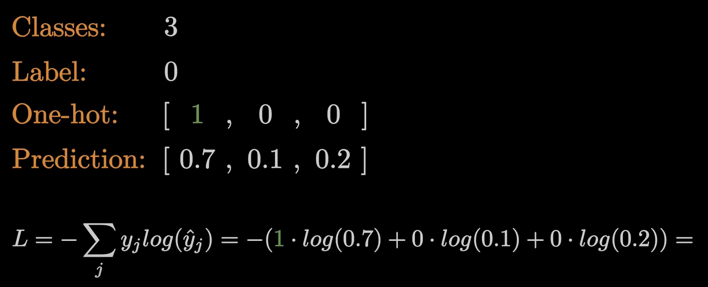

```{r setup, include=FALSE}
knitr::opts_chunk$set(echo = TRUE,
                      cache = TRUE)
```

In this document I will attempt to build a neural net from scratch.  
I am following along to this [video playlist](https://www.youtube.com/watch?v=Wo5dMEP_BbI&list=PLQVvvaa0QuDcjD5BAw2DxE6OF2tius3V3&ab_channel=sentdex),  
and this excellent [book](https://nnfs.io/),  
and adapting the code from Python to R.  

## Part 1: Inputs & Outputs
*Note: the numbers in these beginning sections (for the inputs, weights, & biases) have no meaning. We start by understanding and building the smallest components of a neural net and work our way to the bigger picture.  
In reality, inputs are determined by the data that is fed to the NN. Weights and biases are initialized randomly, and then tuned through the NN's training process. It's useful to just make up some numbers for now.

```{r}

inputs = c(1, 2, 3)
weights = c(0.2, 0.8, -0.5)
bias = 2


# this is the equivalent of a single neuron in a 'hidden' layer
# the inputs and the weights are comined (plus bias) to get the final output for the neuron
output = 
  inputs[1]*weights[1] + inputs[2]*weights[2] + inputs[3]*weights[3] + bias

# the inputs could be from the 'input layer', values from our raw dataset, or they could be outputs from the previous 'hidden layer'
```

What if we wanted to model 3 neurons (a layer) with 4 inputs?

```{r}
#still have 4 inputs
inputs = c(1, 2, 3, 2.5)
#need 3 weight sets
weights1 = c(0.2, 0.8, -0.5, 1.0)
weights2 = c(0.5, -0.91, 0.26, -0.5)
weights3 = c(-0.26, -0.27, 0.17, 0.87)
#and 3 biases
bias1 = 2
bias2 = 3
bias3 = 0.5

#Our output will a list of (3) outputs now, since we are modeling an output layer of 3 neurons
output = 
c(inputs[1]*weights1[1] + inputs[2]*weights1[2] + 
    inputs[3]*weights1[3] + inputs[4]*weights1[4] + bias1, #first neuron output
  inputs[1]*weights2[1] + inputs[2]*weights2[2] + 
    inputs[3]*weights2[3] + inputs[4]*weights2[4] + bias2, #second neuron output
  inputs[1]*weights3[1] + inputs[2]*weights3[2] + 
    inputs[3]*weights3[3] + inputs[4]*weights3[4] + bias3  #third neuron output
  )
output
```
Key takeaway - any given neuron takes some set of inputs, multiplies them by the predetermined weights (these will be set randomly and then **learned/tuned** through training), and adds the bias (also learned through training).  
This results in an output.  
We saw how to code this for a single neuron, receiving 3 inputs (I like to think of this as if we fed the neuron *1 row* from a tabular dataframe with *3 columns*.)  
Then we saw how this would look for a **layer**, that is multiple neurons receiving the same set of inputs, and each performing the input -> output process described above.  
Insights - if we had just one hidden layer and were predicting 3 outputs, like in the second code chunk, these output would be our 3 predicted values for the 3x3 dataframe. So how would we change these predictions?? By tweaking the weights and the bias for each individual neuron - after all, those are the only things modifying the inputs after they're fed into the neuron!

## Part 2: The Building Blocks

### 2.1 Arrays, Matrices, & Shape 
```{r}
# A Vector
my_list = list(3,5,1,2) #mathematically this list of numbers = a vector,
                          #in machine learning, it is often called an array
class(my_list)          #to r, it is a list
  my_list2 = c(3,5,1,2)   #c() combines arguments into a vector/list
  class(my_list2)         #but to r, it is not a 'list' class
```


```{r}
# Shape
# For deep learning we need to know about shape. In Python, shape is the term describing the dimensions of an array or matrix. In R, dimensions or dim() tends to be the word of choice.
  
  #This is a 1 dimensional array, with shape = (4,) - since it has 4 elements, and is 1 dimensional.
my_list = list(3,5,1,2)
length(my_list) #(for 1d lists, we use length() in R)
```


```{r}
#This is a 2 dimensional array, or a matrix, with shape = (2, 4)
list_of_lists = rbind(c(3,5,1,2), 
                      c(1,5,6,3))
dim(list_of_lists)
  #note: we need to use the rbind() function here. if we use list() or c() it won't work.
  #if we wanted, we could use the matrix() function to create the matrix. But that requires specifying the data, and is harder to visualize. Read more here: https://www.datamentor.io/r-programming/matrix/
  #to compare:
not_a_lol = list(c(3,5,1,2),
              c(1,5,6,3))
not_a_lol; list_of_lists
```


```{r}
#This is a three dimensional array, with shape = (2, 4, 3) - (a list of lists, within a list - a lolol)
lolol = array(data = 1:24, dim = c(2, 4, 3))
dim(lolol)
lolol
```
A tensor is an object that *can* be represented as an array. For our machine learning purposes, tensors will be an array.

### 2.2: Dot Product

```{r}
a = c(1, 2, 3)
b = c(2, 3, 4)

dot_product = a[1]*b[1] + a[2]*b[2] + a[3]*b[3]
dot_product
```
Going back to our neuron code...  
A single neuron

```{r}
inputs = c(1, 2, 3, 2.5)
weights = c(0.2, 0.8, -0.5, 1.0)
bias = 2

#The dot product of two vectors is calculated by multiplying them element-wise with * then summing the result. Two ways to do this in R:
#Output =
 sum(weights*inputs) + bias #OR
 weights%*%inputs + bias
 
```
A layer of neurons
```{r}
inputs = c(1, 2, 3, 2.5)
weights = rbind(c(0.2, 0.8, -0.5, 1.0),
                c(0.5, -0.91, 0.26, -0.5),
                c(-0.26, -0.27, 0.17, 0.87))
biases = c(2, 3, 0.5)

#It is important that we write 'weights' first because:
# inputs is a vector, but weights is a matrix. the first element written is how the output will
# be indexed. If we do the opposite, we will get an error.

output = weights%*%inputs + biases
output

# What is really going on here? Consider that weights[1,], weights[2,], etc. are vectors themselves
weights[1,]
# so
c( (weights[1,]%*%inputs) + biases[1], 
   (weights[2,]%*%inputs) + biases[2], 
   (weights[3,]%*%inputs) + biases[3]
  )
#really nothing crazy!
```
### 2.3: Batches
So far, our inputs have been a 1d array.  
We're now going to be passing the neurons a batch, which is essentially a 2d array (or matrix).
Formally, the batch size is the number of samples processed before the model is updated (with tabular data, samples = rows).
Why batch?  
- Generalization/external-validity/test performance. We're going to randomly provide our NN with a batch of samples instead of just feeding it 1 sample at a time. This is easiest to understand visually: https://www.youtube.com/watch?v=TEWy9vZcxW4&ab_channel=sentdex&t=4m57s.  
- Bonus: We can compute batches in parallel.

A layer of neurons
```{r}
#lets code a 'batch' of inputs. this will be a list of lists
inputs = rbind(c(1.0, 2.0, 3.0, 2.5),
               c(2.0, 5.0, -1.0, 2.0),
               c(-1.5, 2.7, 3.3, -0.8)
               )
#the amount of weights & biases doesn't change, since they are associated with individual neurons and we are not chaning the number of neurons 
weights = rbind(c(0.2, 0.8, -0.5, 1.0),
                c(0.5, -0.91, 0.26, -0.5),
                c(-0.26, -0.27, 0.17, 0.87))

biases = c(2, 3, 0.5)
```


```{r eval=FALSE}
# now both weights and inputs are matrices, so we need to do matrix multiplication.
# inputs & weights are the same shape now, so we're going to run into an error if we try to use the dot-product %*%. This is due to how matrix multiplication works: https://www.mathsisfun.com/algebra/matrix-multiplying.html. The number of row-wise elements (4 in this case) needs to match the number of column-wise elements of the other matrix - which is 3, and thus they do not match.  
output = inputs%*%weights + biases
```


```{r}
# Therefore, we need to TRANSPOSE one of the matrices. We're basically just going to make the first row our first column, the second row our second column, and the third row our third column. 
# transposing weights with t()
t(weights)

output = inputs %*% t(weights) + biases[col(inputs%*%t(weights))] 
#Note: to add a row vector (biases) to a matrix, '+ biases' will not work in R
#there are a few options, see: https://stackoverflow.com/questions/39443055/add-a-vector-to-all-rows-of-a-matrix
#The above solution adds each element at the same index so if inputs%*%t(weights) = y,
            # y[1,1] + biases[1], y[1,2] + biases[2], y[1,3] + biases[3],
            # y[2,1] + biases[1], y[2,2] + biases[2], y[2,3] + biases[3],
            # y[3,1] + biases[1], y[3,2] + biases[2], y[3,3] + biases[3]
output
```
Review:
Now that we've decided to feed batches of inputs into our NN, the inputs are actually a 2d array or a matrix. Therefore, their shape matches the shape of the weight matrix, and the two matrices cannot be multiplied *unless* the weights matrix is transposed. 
One way to think of this:
- The *inputs* matrix has shape (3,4)  
- and the **weights** matrix has shape (3,4)  
- but the first element of the *inputs* batch (3)  
- needs to match the second element of the **weights** matrix (4 != 3)  
- thus we <span style="color:blue">transpose</span> the **weights** matrix so that it has shape (4,3).
```{r}
dim(inputs)
dim(weights)
dim(t(weights)) #transposed
```
Lets try adding on some more layers:

```{r}
inputs = rbind(c(1.0, 2.0, 3.0, 2.5),
               c(2.0, 5.0, -1.0, 2.0),
               c(-1.5, 2.7, 3.3, -0.8))

#for first layer
weights = rbind(c(0.2, 0.8, -0.5, 1.0),
                c(0.5, -0.91, 0.26, -0.5),
                c(-0.26, -0.27, 0.17, 0.87))

biases = c(2, 3, 0.5)
#for second layer
weights2 = rbind(c(0.1, -0.14, 0.5),
                c(-0.5, 0.12, -0.33),
                c(-0.44, 0.73, -0.13))
biases2 = c(-1, 2, -0.5)

#feed in input layer to first layer, apply weights and biases
layer1_outputs = inputs%*%t(weights) + biases[col(inputs%*%t(weights))]


#feed in layer 1's outputs as the inputs to layer 2, and apply layer 2 weights and biases
layer2_outputs = layer1_outputs%*%t(weights2) + biases2[col(layer1_outputs%*%t(weights2))]

#final outputs
layer2_outputs
```
## 2.4: Creating a NN function
This code has been relatively simple, but its going to become cumbersome as we scale up the size of the NN. To solve this, we take advantage of Object-Oriented Programming and write a function.

```{r nn-function1}
set.seed(0) #setting a seed for results replication

#X = our feature set
X = rbind(c(1.0, 2.0, 3.0, 2.5),
          c(2.0, 5.0, -1.0, 2.0),
          c(-1.5, 2.7, 3.3, -0.8))

#Hidden layers
  # Weights: we randomly initialize weights (i.e., assign them a random number usually between -1 and 1, but smaller is better).
  # Biases: tend to initialize them as zero.


layer_dense = function(n_neurons, inputs){
  
  n_inputs = ncol(inputs)
  #specifies the number of inputs based on the dimensions (shape) of the input matrix
  #this should be equivalent to the number of features (i.e, columns) in a sample (i.e, a row)
  
#INITALIZE WEIGHTS AND BIASES
  weights = matrix(data = (0.10 * rnorm(n = n_inputs*n_neurons)),
                    nrow = n_inputs, ncol = n_neurons)
  #Number of weights = the number of inputs*number of neurons. 
    #(Multipled by 0.10 to keep small.)
  #In R, we need to convert this to a matrix (of the proper shape) manually.
  #NOTE: we've shaped our weights so that they have n_inputs rows and n_neurons columns,
  #     which means we will not have to transpose them every time we matrix multiply with 
  #     the input batch
  
  biases = matrix(data = 0, nrow = 1, ncol = n_neurons)
  #bias will have shape 1 by number of neurons. we intialize with zeros
  
#FORWARD PASS
  output = inputs%*%weights + biases[col(inputs%*%weights)]
  #again, the inputs will either be the input layer (our data, or X), or
  # they will be the outputs from the previous layer
}

#The result of the function will be to produce the outputs 
```


So we've built a layer function, lets try it:
```{r}
#input X from above, and lets try 5 neurons
layer1 = layer_dense(inputs = X, n_neurons = 5)
#now input the layer1 outputs as the inputs for layer 2, and specify however many neurons
layer2 = layer_dense(inputs = layer1, n_neurons = 2) 
layer2
```

# Part 3: Adding the Activation Function
## 3.1 - Activation Function Overview
Activation functions:
- take an input, modify it, and produce the output
  - The value (output) of inputs*weights + bias is fed into the activation function
  - It is modified according to the properties of the activation function
  - The output of the activation function becomes the input for the next neuron  
Why?  
- The default "activation function" is y = x. This is what we were doing in the simple neurons in the chunks above. This limits us to approximating the input using a linear function.  
- If the true relationship between y and x is nonlinear, we cannot very well approximate it using a linear functional form. [Visual](https://www.youtube.com/watch?v=gmjzbpSVY1A&ab_channel=sentdex&t=7m20s)


**EX: Step Function**  
y = {1 if x > 0;  
     0 if x =< 0}  

- Given any input x, the output will always be equal to zero or 1.  


**EX: Sigmoid Function**  
- we get a more granular output - can better evaluate how well the neuron is actually estimating the truth. Thus, easier to optimize (tune the parameters based on the loss)  
- Problem: vanishing gradient problem.

**EX: ReLU Function**  
y = {x if x > 0;
     0 if x =< 0}  
- Again, a more granular output. Also doesn't face the vanishing gradient issue.
- It's also fast, since it is extremely simple.
- It has proven to work well in real world applications.  
- Why does this work so well? For a single neuron:
  - The weights determine the slope of the linear component (y = x), and the bias determines the 'activation point' - that is, the point where the neuron goes from y = 0 (*inactivated*) to y = x (*activated*).  
  - If the weight is negative, then this flips the rectified linear activation from determining when the neuron *activates*, to when it *deactivates*. [Visual](https://www.youtube.com/watch?v=gmjzbpSVY1A&ab_channel=sentdex&t=9m4s).  
- Add a second neuron with a ReLU activation function:
  - adjusting the bias *vertically* offsets the entire output (from the first neuron)
  - negating the weight of the second neuron creates a lower and upper bound - neuron will be *activated* in between the range. 
  - Watching the related video (i.e., the one linked above) is really useful at this point.
  

A Rectified Linear Function
```{r}
inputs = c(0, 2, -1, 3.3, -2.7, 1.1, 2.2, -100)
output = c()

# if input is greater than zero, the function outputs the exact input
# else if input is less than or equal to zero, the function outputs zero
for (i in 1:length(inputs)){
  input = inputs[i]
  if (input > 0)
    output[i] = input
  else 
    output[i] = 0
}
print(output)

# WITH SAPPLY (alternative to for-loop, which are notoriously slow in R)
# (this will output the maximum between 0 and the input. so if <0, the output is 0)
sapply(X = inputs, 
       function(X){
       max(c(0, X)) 
       })
```

## 3.2 - Updating the Neural Net Function
We are going to implement some basic Object Oriented Programming for R in order to improve the usability of this function as we continue to add to it.  
Specifically, we need to be able to have a **forward pass** of the data, and a **backwards pass**. These terms will be cleared up later.  
For our purposes, this is achievavle simply by using the list method, as seen below. More can be read at this blog post, [Object Oriented R for Programmers](https://rstudio-pubs-static.s3.amazonaws.com/150296_904158e070594471864e89c10c0d14f9.html).  
```{r NN-and-activ-fn}
set.seed(0) #setting a seed for results replication
### The Network
layer_dense = list(
          #setRefClass(Class = "layer_dense", 
          #            fields = c(n_neurons = "numeric", inputs = "array"),
          #            methods = list(
 forward = function(inputs, n_neurons){
   
  n_inputs = ncol(inputs)
      #specifies the number of inputs based on the dimensions (shape) of the input matrix
      #this should be equivalent to the number of features (i.e, columns) in a sample (i.e, a row)
  
  #INITALIZE WEIGHTS AND BIASES
  weights = matrix(data = (0.10 * rnorm(n = n_inputs*n_neurons)),
                    nrow = n_inputs, ncol = n_neurons)
      #Number of weights = the number of inputs*number of neurons. 
      #(Multipled by 0.10 to keep small.)
  
  biases = matrix(data = 0, nrow = 1, ncol = n_neurons)
      #bias will have shape 1 by number of neurons. we initialize with zeros
   
 #FORWARD PASS
 output = inputs%*%weights + biases[col(inputs%*%weights)]
 return(output)
 }
)

activation_ReLU = list(
  forward = function(input_layer){

    output = matrix(sapply(X = input_layer, 
                    function(X){max(c(0, X))}
                    ), 
                  nrow = nrow(input_layer), ncol = ncol(input_layer))
    #This is the same ReLU function we coded above, just coerced into a matrix so the shape
    #is maintained (it will be equivalent to that of the input shape)
    return(output)
  }
)

```


Example:
```{r}
## This is how we use the function now
#X = our feature set
X = rbind(c(1.0, 2.0, 3.0, 2.5),
          c(2.0, 5.0, -1.0, 2.0),
          c(-1.5, 2.7, 3.3, -0.8))
# Create first layer, specify inputs as the raw data (X), and specify number of neurons
  layer1 = layer_dense$forward(n_neurons = 5, inputs = X)
  layer1
  # Pass through activation function
    layer1_out = activation_ReLU$forward(input_layer = layer1)
    layer1_out
# Layer 1 output is the input for layer 2. Pass layer 2 through activation function as well
  layer2 = layer_dense$forward(n_neurons = 2, inputs = layer1_out)
    activation_ReLU$forward(input_layer = layer2)
```


## 3.3 - Simulating Data & Running Neural Net Function

In the tutorial, they create a spiral-shaped multi-class dataset to use as an example. I recreate that here with code found on this [blog post](https://towardsdatascience.com/build-your-own-neural-network-classifier-in-r-b7f1f183261d).
```{r sim-data}
## Creating Data
# Source:
N = 100 # number of points per class
D = 2 # dimensionality
K = 3 # number of classes
X = data.frame() # data matrix (each row = single example)
y = data.frame() # class labels
 
set.seed(123)
 
for (j in (1:K)){
  r = seq(0.05,1,length.out = N) # radius
  t = seq((j-1)*4.7,j*4.7, length.out = N) + rnorm(N, sd = 0.3) # theta
  Xtemp = data.frame(x =r*sin(t) , y = r*cos(t)) 
  ytemp = data.frame(matrix(j, N, 1))
  X = rbind(X, Xtemp)
  y = rbind(y, ytemp)
}
spiral_data = cbind(X,y)
colnames(spiral_data) = c(colnames(X), 'label')

spiral_X = spiral_data[,c("x","y")]

plot(spiral_data$x, spiral_data$y, col = spiral_data$label)
```

Pass through our neural net.
```{r}
##Convert inputs to matrix format
spiral_X = as.matrix(spiral_X)

set.seed(1)
##Build network
# Layer 1
  layer1 = layer_dense$forward(inputs = spiral_X, n_neurons = 5)
    layer1_out = activation_ReLU$forward(input_layer = layer1)
    head(layer1_out)
# Layer 2 (Note, we can use the (base) pipe to pipe the layer outputs right into the activation fn)
  layer2_out = layer_dense$forward(inputs = layer1_out, n_neurons = 3) |>
                  activation_ReLU$forward()
  head(layer2_out)
```

# Part 4: Softmax Activation
Softmax is another activation function that is common in classification problems, especially multi-class classification. **Why?**   
- In a classification setting like the one we've set up for ourselves, the final output of the neural network, for each sample (i.e, row) will ideally be a probability distribution, or a set of probabilities. That is, for each of the 3 classes in the data, the NN will decided the relative likelihood of each class (given the inputs and the weights/biases it has learned).  
- ReLU won't output a usable probability distribution. (Further, consider that if the ReLU receives a negative number, it will clip it to zero, so if our prediction for the 3 classes [class 1, class 2, class 3] was [-1, -2, 3], our final output would be [0, 0, 3] and our best guess at the probability distribution would be [0%, 0%, 100%]. This just completely ignores any meaning in these NN's predictions.)  
**How?**  
- FORMULA
- An exponential function takes the form of $y = e^x$, where the output is equal to Euler's number (2.71828...) raised to the input x. This is helpful because even if the input is negative, the output will be positive, but the granularity and "meaning" is not lost (no clipping to zero). 
- Then we *normalize* the values - take a single output neuron's value, and divide it by the sum of all the other output neurons' values in the output layer.
- This results in a probability distribution.  
In code:
```{r softmax-example}
#The output of some prior hidden layer are the inputs to the function
some_layer_outputs = c(4.8, 1.21, 2.385)

## Exponentiate the values
exp_values = c()
for (i in 1:length(some_layer_outputs)){
  exp_values[i] = exp(some_layer_outputs[i])
}
exp_values

## Normalize
norm_base = sum(exp_values) ##the denominator
norm_values = c()
for (i in 1:length(exp_values)) {
  norm_values[i] = exp_values[i]/norm_base
}
norm_values
sum(norm_values)
# a probability distribution!
```

Let's simplify this and prepare it for use in our neural net.
```{r softmax-implement}
# first, we're going to be training in batches, so let's update the inputs
some_layer_outputs = rbind( c(4.8, 1.21, 2.385),
                            c(8.9, -1.81, 0.2),
                            c(1.41, 1.051, 0.026)
                          )

## Exponetiation
exp_values = exp(some_layer_outputs)

## Normalization
norm_base = matrix(rowSums(exp_values),   #use rowSums to sum across rows
                   nrow = nrow(some_layer_outputs), ncol = 1) #keep shape
    # Provides 3 sums, one for each row. Each row-sum will serve as denominator
    # in the normalization step for its specific row.

norm_values = sapply(X = 1:nrow(some_layer_outputs),              #RECURSIVELY
                     FUN = function(X){exp_values[X,]/norm_base[X]} #NORMALIZE
                     ) 
## The output:
# Each row represents an output neuron. 
# Each column corresponds to a sample that was passed in with the input batch 
norm_values
```

**Overflow Error Prevention**  
Keep in mind that exponentiation can result in some very large numbers and we could run into an overflow error. For example, compare `exp(2)` to `exp(5)` to `exp(710)`.     
To avoid this, we can scale the values so that, for each row, we subtract the largest value in that row from each element.     
This makes the largest value 0, and all others negative, so that the exponentiated values lie between 0 and 1.   
We will implement this when we incorporate Softmax into our NN function. It can be achieved easily with R's 'apply'.

```{r}
## Scale input matrix by max value
max_value = apply(X = some_layer_outputs, MARGIN = 2, 
      FUN = max) #margin=2 indicates cols. see ?apply

# Subtract max col value from each element in corresponding column
sapply(X = 1:ncol(some_layer_outputs), 
       FUN = function(X){
              some_layer_outputs[,X] - abs(max_value[X]) 
              #select column, subtract corresponding maximum
                  }
       )
##NOTE: important to take the absolute value of max_value[X] since if we have
# a negative value for the max_value, subtracting by it will actually add it to
# the "some_layer_outputs" and we could run back into the overflow error.
```


## Update the NN function(s)
We're going to add the Softmax activation function into our working group of functions.

```{r NN-ReLU-Softmax}
### Dense Layers ----
layer_dense = list(
## FORWARD PASS FUNCTION 
 forward = function(inputs, n_neurons){
   
  n_inputs = ncol(inputs)
      #specifies number of inputs based on dims (shape) of the input matrix
      #should be equal to # of features (i.e, columns) in a sample (i.e, a row)
  
  #INITALIZE WEIGHTS AND BIASES
  weights = matrix(data = (0.10 * rnorm(n = n_inputs*n_neurons)),
                    nrow = n_inputs, ncol = n_neurons)
      #Number of weights = the number of inputs*number of neurons. 
      #(Multipled by 0.10 to keep small.)
  
  biases = matrix(data = 0, nrow = 1, ncol = n_neurons)
      #bias will have shape 1 by number of neurons. we initialize with zeros
   
 #FORWARD PASS
 output = inputs%*%weights + biases[col(inputs%*%weights)]
 return(output)
 }
)
### Activation Functions ----
## ReLU
activation_ReLU = list(
  forward = function(input_layer){

    output = matrix(sapply(X = input_layer, 
                    function(X){max(c(0, X))}
                    ), 
                  nrow = nrow(input_layer), ncol = ncol(input_layer))
    #ReLU function coerced into a matrix so the shape
    #is maintained (it will be equivalent to that of the input shape)
    return(output)
  }
)

## SoftMax
activation_Softmax = list(
  forward = function(inputs){
          #scale inputs
          max_value = apply(X = inputs, MARGIN = 2,  FUN = max)
          scaled_inputs = sapply(X = 1:ncol(inputs), 
                 FUN = function(X){
                    inputs[,X] - abs(max_value[X])})
          # exponetiate
          exp_values = exp(scaled_inputs)
          # normalize
          norm_base = matrix(rowSums(exp_values), nrow = nrow(inputs), ncol = 1)
          probabilities = sapply(X = 1:nrow(inputs),
                          FUN = function(X){exp_values[X,]/norm_base[X]}) 
          return(t(probabilities))
          #(transpose probabilities)
          }
)
```


Let's test it on the spiral data. Recall, this is a multi-class classification task, with 3 potential classes (class 1, 2, or 3).
```{r}
##Convert inputs to matrix format
spiral_X = as.matrix(spiral_X)

set.seed(1)
##Build network
  # Hidden Layer 1
  layer1 = layer_dense$forward(inputs = spiral_X, n_neurons = 5) |>
                  activation_ReLU$forward()
  # Hidden Layer 2
  layer2 = layer_dense$forward(inputs = layer1, n_neurons = 4) |>
                  activation_ReLU$forward()
  # Output Layer
    #Important to set n_neurons = 3, since there are 3 classes to predict
  layer3 = layer_dense$forward(inputs = layer2, n_neurons = 3) |>
                  activation_Softmax$forward()

# For each sample (corresponding to a row in this output matrix), we have a 
# prediction for each class (corresponding to the column in this matrix)
head(layer3)  
```


We can see that the model has essentially predicted a 1/3 probability for each class, for all of the samples. This makes sense, considering we haven't trained the model at all yet, and simply given it randomly intialized weights and biases.  


# Part 5: The Loss Function
To measure the performance of the model, we need some _metric_ that describes the error, or 'loss'. For classification tasks, **cross-entropy** is the most common loss function, since it captures not just the accuracy of the predicted classification but the relative confidence (i.e., it considers the predicted _probability_).  
Specifically, the lower the confidence (the lower the predicted probability for a given class), the higher the loss value will be.

**Categorical Cross-Entropy**  
[formula]  
Simplifies (due to one-hot encoding) to:  
$ L_i = -log( \hat y_{i,k} ) $  
Which is just the negative log of the predicted target class probability.  
(To understand this, watch from [here](https://youtu.be/dEXPMQXoiLc?t=493). As a preview, here is a screenshot. Keep in mind that in Python, the first index is 0, while it is 1 in R).   



In code:  
```{r}
#Example output values:
  softmax_output = c(0.1, 0.7, 0.2)
#Example target value:  (classes: 1, 2, 3)
  TargetValue = 2
#One-Hot Encoded
  target_output = c(0, 1, 0 )

#Calculate Categorical Cross-Entropy
loss = -(  log(softmax_output[1])*target_output[1] + # = 0
           log(softmax_output[2])*target_output[2] + # = log(0.7)
           log(softmax_output[3])*target_output[3]   # = 0
        )
loss

#OR
-log(0.7)
```


To implement this into our neural net, we'll need to adjust so that it will work with the batches we train on, since each batch will return a batch of (softmax) outputs at the end of the network which match to a batch of targets.  
For example,
```
softmax outputs:                 target                 corresponding
                                  class(1,2,or3):      confidences:                
    (Neuron1,Neuron2,Neuron3)
      Class1, Class2, Class3
sample1 [0.7,  0.1,  0.2],        [1,                   [0.7,
sample2 [0.1,  0.5,  0.4],         2,                    0.5, 
sample3 [0.02, 0.9, 0.08]          2]                    0.9]

```
in R:

```{r}
softmax_output = rbind(c(0.7, 0.1, 0.2),
                       c(0.1, 0.5, 0.4),
                       c(0.02, 0.9, 0.08))
class_target = c(1, 2, 2)

# Select the specific probabilities, based on the sample (the row # of the matrix)
# and the target class (which corresponds to the neuron that represents that
# class, and thus the column in the above matrix)
indices = cbind(1:nrow(softmax_output), class_target)
softmax_output[indices]
```


Now, we can add this into the (simplified) cross-entropy loss function:
```{r}
neg_log = -log(softmax_output[
        cbind(1:nrow(softmax_output), class_target) #subset
      ])
neg_log
```


And the loss for this batch is just the average loss:
```{r}
average_loss = mean(neg_log)
average_loss
```

One problem - if we predict confidence (probability) of zero, we would find that `-log(0) = -Inf`, which will be unusable as an output. We need to make sure this error is avoided, so we can restrict the output to be within the bounds of 0.0000001 (`1e-7`) and `1 - 1e-7`:

```{r Clip-function}
my_clip = function(x, min, max){
  ifelse(x <= min, min, 
         ifelse(x >= max, max, x))
}

#Example
example_probs = c(0.3566, 0.0, 1)
my_clip(x = example_probs, min = 1e-7, max = (1-1e-7))
```


Review:
- Each `[]` represents a neuron. Imagine we have passed forward a batch of 1 sample.
- Number of output layer neurons = number of possible classes
- Output layer neurons produce the linear combination of weights and biases from all the previous layer's neurons (which it is densely connected to).
- This is passed into the softmax activation function which effectively provides us with a probability distribution, so each output is a value between 0 and 1. These are our label predictions, or **y_hat**.
- These probabilities are clipped just before 0 and 1 as a programming hack to avoid an error when calculating loss
- The clipped values are fed into the loss function. After one-hot encoding the TRUE target labels (**y_true**), this is simply the negative log of the (clipped) y_hat.
- The total loss for the batch is just the average of the calculated losses for each sample. (In this example, the "batch" is just a single sample, so sample loss = batch loss.)

```
    Final Hidden Layer        Output Layer                                                      
        []                                    (prob./y_hat)      (calculate sample loss)       
        []                        [] -softmax->  (0.2)        
 ....    . (weights + biases)            
         . ------------------>    [] -softmax->  (0.7)   -clip->  -log(y_hat_clipped) -->
         .       (dense)
        []                        [] -softmax->  (0.1)   
        []
```


### Update the Function!
Note, we take special steps to ensure that calculating categorical cross-entropy will work regardless if the user one-hot encodes the target labels (which is common practice, but not universal). See the code chunk below to see the logic begind how the inputs need to be transformed.

```{r NN-activ-loss}
### Dense Layers ----
layer_dense = list(
## FORWARD PASS FUNCTION 
 forward = function(inputs, n_neurons){
   
  n_inputs = ncol(inputs)
      #specifies number of inputs based on dims (shape) of the input matrix
      #should be equal to # of features (i.e, columns) in a sample (i.e, a row)
  
  #INITALIZE WEIGHTS AND BIASES
  weights = matrix(data = (0.10 * rnorm(n = n_inputs*n_neurons)),
                    nrow = n_inputs, ncol = n_neurons)
      #Number of weights = the number of inputs*number of neurons. 
      #(Multipled by 0.10 to keep small.)
  
  biases = matrix(data = 0, nrow = 1, ncol = n_neurons)
      #bias will have shape 1 by number of neurons. we initialize with zeros
   
 #FORWARD PASS
 output = inputs%*%weights + biases[col(inputs%*%weights)]
 return(output)
 }
)
### Activation Functions ----
## ReLU
activation_ReLU = list(
  forward = function(input_layer){

    output = matrix(sapply(X = input_layer, 
                    function(X){max(c(0, X))}
                    ), 
                  nrow = nrow(input_layer), ncol = ncol(input_layer))
    #ReLU function coerced into a matrix so the shape
    #is maintained (it will be equivalent to that of the input shape)
    return(output)
  }
)

## SoftMax
activation_Softmax = list(
  forward = function(inputs){
          #scale inputs
          max_value = apply(X = inputs, MARGIN = 2,  FUN = max)
          scaled_inputs = sapply(X = 1:ncol(inputs), 
                 FUN = function(X){
                    inputs[,X] - abs(max_value[X])})
          # exponetiate
          exp_values = exp(scaled_inputs)
          # normalize
          norm_base = matrix(rowSums(exp_values), nrow = nrow(inputs), ncol = 1)
          probabilities = sapply(X = 1:nrow(inputs),
                          FUN = function(X){exp_values[X,]/norm_base[X]}) 
          return(t(probabilities))
          #(transpose probabilities)
          }
)

### Loss ----
Categorical_CrossEntropy = list(
forward = function(y_pred = "softmax output", y_true = "targets"){
    
    #DETECT NUMBER OF SAMPLES
    samples = length(y_true)  
      #gives us the # of samples since y_pred will be a vector of predictions
      #for each sample
    
        #unique_labels = length(unique(y_true))
        #determines how many unique target labels exist in the y_true 
    
    #CLIP SAMPLES TO AVOID -Inf ERROR
    y_pred_clipped = ifelse(y_pred <= 1e-7, 1e-7, 
                        ifelse(y_pred >= (1-1e-7), (1-1e-7), y_pred))
    

    #DETERMINE IF Y_TRUE IS ONE-HOT-ENCODED AND SELECT CORRESPODNING CONFIDENCES
    confidences = ifelse(nrow(t(y_true)) == 1, 
                  #if y_true is a single vector of labels, then confidences =
                    y_pred_clipped[cbind(1:samples, y_true)],
                      
                      ifelse(nrow(y_true) > 1,
                      #else, if y_true is one-hot encoded, then confidences =
                             rowSums(y_pred_clipped*y_true),
                             #else
                             "error indexing the predicted class confidences"
                             )
                        )
                    
    #CALC LOSS FOR EACH SAMPLE (ROW)
    neg_log_likelihoods = -log(confidences)
    return(neg_log_likelihoods)
    
  }
  
)

```


What's going on with the subsetting of the confidences? An example:
```{r cat-crossent-subset-ex}
samples = 3
y_pred_clipped = rbind(c(0.7, 0.1, 0.2),
                       c(0.1, 0.5, 0.4),
                       c(0.02, 0.9, 0.08))

y_true_vec = c(1,2,2)  #(a y_true that is not one-hot encoded)
y_true_ohe = rbind(c(1, 0, 0), #(a y_true that is one-hot encoded)
                   c(0, 1, 0),
                   c(0, 1, 0))
  
#IF NOT ONE-HOT ENCODED this subsetting method will work
y_pred_clipped[cbind(1:samples, y_true_vec)]

# IF ONE_HOT ENCODED we can do this instead
#(note, this mutltiples the matrix of predicted probs by the one-hot encoded 
# matrix, which means it will mutliply the values we want by 1 and the wrong 
# values by 0)
y_pred_clipped*y_true_ohe

#Then applying a row sum will help us get rid of the unneccessary zeros
rowSums(y_pred_clipped*y_true_ohe)
```


Okay, now let's try out the loss function.
```{r}
##Convert inputs to matrix format
spiral_X = as.matrix(spiral_X)

set.seed(1)
##Build network
  # Hidden Layer 1
  layer1 = layer_dense$forward(inputs = spiral_X, n_neurons = 5) |>
                  activation_ReLU$forward()
  # Hidden Layer 2
  layer2 = layer_dense$forward(inputs = layer1, n_neurons = 4) |>
                  activation_ReLU$forward()
  # Output Layer
    #Important to set n_neurons = 3, since there are 3 classes to predict
  layer3 = layer_dense$forward(inputs = layer2, n_neurons = 3) |>
                  activation_Softmax$forward()

# For each sample (corresponding to a row in this output matrix), we have a 
# prediction for each class (corresponding to the column in this matrix)
head(layer3)  

#Our true labels are a vector (not one-hot encoded) of labels:
head(spiral_data$label)

   #CALCULATE LOSS
  loss = Categorical_CrossEntropy$forward(
    y_pred = layer3, y_true = spiral_data$label)
    loss

#Let's try one-hot encoding the labels to check our function
    labels_ohe = do.call(rbind, 
        lapply(spiral_data$label, 
               function(i) as.integer(
                 !is.na(match(unique(
                   unlist(spiral_data$label)
                                    ), i)
                   ))
              ))

    head(labels_ohe)
    
    Categorical_CrossEntropy$forward(y_pred = layer3, y_true = labels_ohe)

```


```{r one-hot-encoder}
#Let's try one-hot encoding the labels to check our function
labels_ohe = do.call(rbind, 
    lapply(spiral_data$label, 
           function(i) as.integer(
             !is.na(match(unique(
               unlist(spiral_data$label)
                                ), i)
               ))
          ))
```

```{r anti-onehot}
##Make function that turns one-hot encoded array into vector of discrete classes

#y_true_vector = c(1, 2, 2)
y_true = rbind(c(1, 0, 0), #(a y_true that is one-hot encoded)
               c(0, 1, 0),
               c(0, 1, 0))

anti_ohe = function(y_true){
           unique_classes = ncol(y_true)
           samples = nrow(y_true)
           y_true_vec = as.vector(y_true)
                
           class_key = rep(1:unique_classes, each = samples)
           y_true = class_key[y_true_vec==1]
                #selects the classes that correspond to 1s in y_true vector
                return(y_true)
                }

y_true = if(nrow(y_true) > 1){ #if one-hot encoded
                #change to sparse
                anti_ohe(y_true)
          }

y_true
```


# Part 6: Optimization & Backpropogation
Now that we can pass data through the neural net, predict classes, and have established a clear measurement of the loss or error in our predictions, we can begin the process of optimizing the weights and biases that manipulate the inputs throughout the network.  

WATCH 3B1B!! Notes:
Essentially, we will compute the gradient of the loss function. The loss function takes as an input the weighted sum of all the inputs, weights, and biases, and therefore its gradient is a vector of the partial derivates of the loss function with respect to each of its inputs. To calculate this, we'll have to use the **chain rule** since we have many nested function. A gradient is a vector (i.e, a direction to move) that points in the direction of greatest increase of a function. [Here is an intutitive explanation.](https://betterexplained.com/articles/vector-calculus-understanding-the-gradient/#:~:text=The%20gradient%20is%20a%20fancy,a%20function%20(intuition%20on%20why).  
We use the negative gradient since we want to minimize loss, not increase it (i.e, move down the loss function). The values in this vector tell us what nudges we need to make to all of the weight & biases in the network in order to make the fastest possible decrease in the output of the loss function.   
Changing the output of any given neuron is possible by changing the bias, changing the weights, or changing the activations (outputs) from the previous layer. For example, say we want to increase the output of a neuron so that its output is closer to the true value. After computing the gradient and deciding how to nudge these inputs, we will that the biggest strengthening of a connection - i.e, increasing of a weight - will happen between the neurons in the prior layer which are most active (i.e, have the largest output values) and the ones we want to become more active (i.e, our example neuron).  
I love [3B1B's example](https://youtu.be/Ilg3gGewQ5U?t=352) here. Imagine we are feeding the normalized pixel values of an image of a "2" (as in the classic MNIST example) as inputs into a neural net. 
```
            Input Layer    Neuron corresponding to 2
                  [] 
                  [] 
                  []
 ________          .                    .
 \_____  \         .                    .
  /  ____/         .
 /       \ ------> . --------------->  [] 2
 \_______ \        .                    .
         \/        .                    .
                  []
                  []
                  []
            ("seeing the 2")   ("thinking about a 2")
```
The neurons "firing" or most active when _seeing the 2_ (i.e, relative to other neurons they produce the largest output from their activation function) get strongly linked (i.e, learn to have the largest weights) to the neuron in the next layer which is _thinking about a 2_ (i.e, we have assigned the neuron to predict "2"). This is the intuition behind the common phrase, **"neurons that fire together wire together."**  


This will require some calculus. For those in need of a refresher, the [Neural Networks from Scratch in Python](https://nnfs.io/) book provides an easy-to-follow explanation. Here is an excerpt:
> "The partial derivative is a single equation, and the full multivariate function’s derivative consists of a set of equations called the gradient. In other words, the gradient is a vector of the size of inputs containing partial derivative solutions with respect to each of the inputs." (Chapter 8)

Beyond the basics of differentiation, partial differentiation, and the chain rule, a reminder that I found useful was:  
_Partial Derivative of a Max Function_  
$ \frac{\partial max(x,y)}{\partial x} = 1(x > y) $. Since the partial derivative of x with respect to x is 1, then the derivative of this function with respect to x = 1 **if** x is greater than y, but equals 0 if y is greater than x. We read the output as (x>y)=1 if true, 0 if false.

Now consider our ReLU function, which is defined as $max(x, 0)$.  
$ f'(x) = \max'(x,0) = 1(x > 0) $ which equals 1 when x>0, and 0 otherwise. 


Now let's try a simplified form of backpropagation as an example. We will backpropagate the ReLU function for a single neuron and act as if we intend to minimize the output for this single neuron (while in reality, we're minimizing loss not output).  
It helps to think of the process as a nest of functions, to which we can apply the chain rule:  
$ReLU(\sum[inputs*weights] + bias) $, and as seen in the book:  

```{r}
x = c(1.0, -2.0, 3.0)  #inputs
w = c(-3.0, -1.0, 2.0) #weights
b = 1.0 #bias

#Forward pass inputs and weights to a single neuron, "z"
xw1 = x[1]*w[1]
xw2 = x[2]*w[2]
xw3 = x[3]*w[3]

#Summing weighted inputs and bias
z = xw1 + xw2 + xw3 + b
z

# Applying ReLU Activation function
y = max(z, 0)
y

## BACKWARD PASS
# Assume the neuron receives a gradient of 1 from the next layer 
  #(i.e, the layer that precedes it in backpropagation)

  #Derivative value from previous layer
  dvalue = 1
  
  #ReLU Derivative
  drelu_dz = ifelse(z > 0, 1, 0)
  drelu_dz
  
  #Partial Derivatives of the Sum With Respect to mul(x, w)
  dsum_dxw1 = 1
  dsum_dxw2 = 1
  dsum_dxw3 = 1
  dsum_db = 1

#Chain rule: Partial derivatives of relu with respect to the xw's
drelu_dxw1 = drelu_dz * dsum_dxw1
drelu_dxw2 = drelu_dz * dsum_dxw2
drelu_dxw3 = drelu_dz * dsum_dxw3
drelu_db = drelu_dz * dsum_db

#Chain rule: Partial derivative of the mul(x, w) with respect to x, w
dmul_dx1 = w[1]
 dmul_dx2 = w[2]
  dmul_dx3 = w[3]
dmul_dw1 = x[1]
 dmul_dw2 = x[2]
  dmul_dw3 = x[3]

drelu_dx1 = drelu_dxw1 * dmul_dx1
 drelu_dw1 = drelu_dxw1 * dmul_dw1
  drelu_dx2 = drelu_dxw2 * dmul_dx2
drelu_dw2 = drelu_dxw2 * dmul_dw2
 drelu_dx3 = drelu_dxw3 * dmul_dx3
  drelu_dw3 = drelu_dxw3 * dmul_dw3
     
##GRADIENTS (vectors containing the partial derivatives for each input)
dx = c(drelu_dx1, drelu_dx2, drelu_dx3)  #gradients on inputs
dw = c(drelu_dw1, drelu_dw2, drelu_dw3)  #gradients on weights
db = drelu_db #gradient on bias
  
#we can now apply these gradients to the weights minimize the output.
#"We apply a negative fraction to this gradient since we want to decrease the 
# final output value, and the gradient shows the direction of the steepest 
# ascent", rather than descent
# (this is what an optimizer does)

w[1] = w[1] + -0.001*dw[1]
w[2] = w[2] + -0.001*dw[2]
w[3] = w[3] + -0.001*dw[3]
b = b + -0.001*db
w; b


#Now that we've slightly tweaked the weights & biases, we can see the effects:
z = x[1]*w[1] + x[2]*w[2] + x[3]*w[3] + b  #weighted summation
y = max(z, 0) #apply ReLU
y  #decreased from 6

```

Let’s consider multiple neurons in the following layer (3). Each neuron from the next layer will return a partial derivative of its function with respect to this input. The neuron in the current layer will receive a vector consisting of these derivatives. We need this to be a singular value for a singular neuron, so we will sum the vector.

Now consider if we replace our singular neuron with a layer of neurons. Each neuron from the current layer will receive the vector of partial derivatives from the following layer, during backpropogation. With a layer of neurons, this will be a list of these vectors, or a 2D array.  
Each neuron outputs a gradient of the partial derivatives with respect to all of its inputs. We need to sum along the inputs — the first input to all of the neurons, the second input, and so on, meaning we will sum by column. 

```{r}
#Gradient passed in from the following layer.
# (corresponds to the gradient vector for a single sample)
dvalues = c(1, 1, 1)

#3 sets of weights - one for each neuron
#4 inputs - thus 4 weights in each set
                #input1,input2,input3,input4
weights = rbind(c(0.2,    0.8,   -0.5,    1), #neuron1
                c(0.5,  -0.91,  0.26,  -0.5), #neuron2
                c(-0.26, -0.27, 0.17,  0.87)  #neuron3
                ) |> t() #transpose weights

#sum weights and multiply by value passed in from previous layer
#(we sum by row since we sum across inputs and we have transposed the matrix)
dx1 = sum(weights[1,]*dvalues)
dx2 = sum(weights[2,]*dvalues)
dx3 = sum(weights[3,]*dvalues)
dx4= sum(weights[4,]*dvalues)

#dinputs = gradient of neuron function with respect to inputs
dinputs = c(dx1, dx2, dx3, dx4)
dinputs

#the sum of the multiplication 
#of the elements is the dot product, so in R we can simplify
dvalues%*%t(weights)
```


```{r}
###Let's do it with a batch
#3 gradient vectors means 3 samples in this batch
dvalues = rbind(c(1, 1, 1),
                c(2, 2, 2),
                c(3, 3, 3))
weights = rbind(c(0.2, 0.8, -0.5, 1),
                c(0.5, -0.91, 0.26, -0.5),
                c(-0.26, -0.27, 0.17, 0.87)) |> t() #transpose weights
# sum weights of given input
# and multiply by the passed in gradient for this neuron
dinputs = dvalues%*%t(weights)
dinputs
```


> "We’re going to be using gradients to update the weights, so we need to match the shape of weights, not inputs. Since the derivative with respect to the weights equals inputs, weights are transposed, so we need to transpose inputs to receive the derivative of the neuron with respect to weights. Then we use these transposed inputs as the first parameter to the dot product — the dot product is going to multiply rows by inputs, where each row, as it is transposed, contains data for a given input for all of the samples, by the columns of dvalues." (NNFS, Ch. 9)


```{r}
# We have 3 sets of inputs - samples
inputs = rbind(c(1,    2,    3,   2.5),
               c(2.,   5.,   -1.,   2),
               c(-1.5, 2.7, 3.3, -0.8))
#sum weight of given input
#dweights = gradient of neuron function with respect to the weights
dweights = t(inputs)%*%dvalues
dweights


#dbiases - sum values across samples 
dbiases = colSums(dvalues)
dbiases
#the derivatives with respect to biases come from the sum operation 
# and always equal 1, multiplied by the incoming gradients 
#to apply the chain rule.
#Since gradients are a list of gradients (a vector of gradients for each 
#neuron for all samples), we just have to sum 
#them with the neurons, column-wise
```


For the backward pass, ReLU() receives a gradient of the same shape. The
derivative of the ReLU function will form an array of the same shape, filled with 1 when the related input is greater than 0, and 0 otherwise.
```{r}
#Example layer output
z = rbind(c(1, 2, -3, -4),
          c(2, -7, -1, 3),
          c(-1, 2, 5, -1)
          )

dvalues = rbind(c(1, 2, 3, 4),
                c(5, 6, 7, 8),
                c(9, 10, 11, 12))

#ReLU activation's derivative
drelu = matrix(data = 0, nrow = nrow(z), ncol = ncol(z)) #fill with zeros
drelu[z>0] = 1  #change 0 to 1 if the value in z was >1

#Apply chain rule:
drelu = drelu*dvalues


#Since the ReLU derivative is either zero or 1, we can simplify this step
#into one where we simply change any values in dvalues to 0 if the
#element that corresponds to it in z is <0
drelu = dvalues
drelu[z<=0] = 0
```


TO REVIEW  
We’ll minimize ReLU’s output, just for the sake of an example:
```{r}
#Gradient passed in from the following layer.
dvalues = rbind(c(1, 2, 3, 4),
                c(5, 6, 7, 8),
                c(9, 10, 11, 12))
# We have 3 sets of inputs - 3 samples
inputs = rbind(c(1,    2,    3,   2.5),
               c(2.,   5.,   -1.,   2),
               c(-1.5, 2.7, 3.3, -0.8))

#3 sets of weights - one for each neuron
#4 inputs - thus 4 weights in each set
weights = rbind(c(0.2, 0.8, -0.5, 1),        #neuron1
                c(0.5, -0.91, 0.26, -0.5),   #neuron2
                c(-0.26, -0.27, 0.17, 0.87)  #neuron3
                ) |> t() #transpose weights
#biases - just one for each neuron
biases = c(2, 3, 0.5)

#FORWARD PASS
layer_outputs = inputs%*%weights + biases[col(inputs%*%weights)] #Dense Layer
relu_outputs = sapply(X = layer_outputs, 
                function(X) max(c(0, X)) ) |> 
            matrix(nrow = nrow(layer_outputs), ncol = ncol(layer_outputs))

#OPTIMIZE/BACKPROPOGATE
#relu - simulate derivative with respect to inputs
drelu = relu_outputs
drelu[layer_outputs <= 0] = 0

#dense layer
#dinputs - multiply by weights (w) transposed
 dinputs = drelu%*%t(weights)
#dweights - multiply by inputs (x) transposed
 dweights = t(inputs)%*%drelu
#dbiases - sum values across samples, which corresponds to neurons, and will
 #be a colSum
 dbiases = colSums(drelu)

# Update parameters
new_weights = weights + -0.001*dweights
new_biases = biases + -0.001*dbiases

new_weights
new_biases
```

That was just an example, where we were updating the weights and biases in order to minimize the ReLU output for each neuron, which we won't be doing in practice. But these are essentially the steps we will follow during backpropogation. Consider this excerpt:  
> "During the backward pass, we’ll calculate the derivative of the loss function, and use it to multiply with the derivative of the activation function of the output layer, then use this result to multiply by the derivative of the output layer, and so on, through all of the hidden layers and activation functions. Inside these layers, the derivative with respect to the weights and biases will form the gradients that we’ll use to update the weights and biases. The derivatives with respect to inputs will form the gradient to chain with the previous layer. This layer can calculate the impact of its weights and biases on the loss and backpropagate gradients on inputs further." (NNFS, Chapter 9)


We're also going to need the **Categorical Cross-Entropy loss function derivative**, i.e, the partial derivative of the loss function with respect to each of its inputs.  This simplifies so that _the derivative of the loss function with respect to its inputs_ (which are the predicted values) = _the negative of the ground-truth vector_ divided by _the vector of predicted values_, or  
$\frac{\partial}{\partial \hat y}[-\sum y \cdot log(\hat y)] = - \frac{y}{\hat y}$   
(subscripts excluded).


Finally, we will need the **Softmax activation function derivative**, which simplifies to:  
  

Where $S_{i,j}$ is the j-th Softmax output from the i-th sample,  $S_{i,k}$ is the k-th Softmax output for the i-th sample, and $\delta$ is a Kronecker delta function.
The Kronecker delta equals 1 when both inputs are equal, and 0 otherwise.  
Simplifying the derivative in this way is done partially to make it easier to code. Again, [the book](https://nnfs.io/) has a thorough explanation (Ch.9, page 46).

For the left term of the above equation, we need to multiply the softmax output with the Kronecker delta. If we visualized the Kronecker delta as a 2d array, it would be full of zeros except for 1s on the diagonal, where the indices are equal. Therefore, we can convert the softmax output vector to be the diagonal of a matrix of zeros:
```{r}
#output for a single sample
softmax_output = c(0.7, 0.1, 0.2)
#shape as a list of samples using 'diag' function
diag(softmax_output)
```
The other part of the equation is $S_{i,j}S_{i,k}$— the multiplication of the Softmax outputs, iterating over the j and k indices respectively. We can use the dot product operation for this, and transpose the second argument to the row vector form.
```{r}
softmax_output%*%t(softmax_output)
```

And combine these operations:
```{r}
diag(softmax_output) - softmax_output%*%t(softmax_output)
```

Worth noting that the resulting matrix is known as a _Jacobian Matrix_, which is a matrix of partial derivatives in all of the combinations of both input vectors. 


```{r}
# Forward
## activation_Softmax$forward(inputs) produces:
softmax_output = rbind(c(0.7, 0.1, 0.2),
                       c(0.2, 0.3, 0.5)) ##(2 samples)
softmax_output

# Backprop
##Derivatives from previously backpropd function
dvalues = matrix(rnorm(6), 2, 3)

##Create zero array the shape of the dvalues to be filled in
dinputs = matrix(0, nrow=nrow(dvalues), ncol=ncol(dvalues))
##Going sample by sample (row by row) select 1 sample's output and the dvalues
##But convert each row to a column vector
single_output = matrix(softmax_output[1,]) 
single_dvalues = matrix(dvalues[1, ])
single_output
  
# Calculate jacobian matrix of output
##Note: need to convert single_output to simple vector with c() for diag to work
jacobian_matrix = diag(c(single_output)) - (single_output %*% t(single_output)) 
jacobian_matrix #3x1 vector %*% 1x3 vector produces a 3x3 matrix

# Calculate sample-wise gradient (chain rule), add to array of gradients (as a row)
##Note: The jacobian is a 3x3 matrix and the dvalues is a list of 3 numbers. It 
##had to be converted to a 3x1 vector since a 3x3 can't multiply with a 1x3.
##Also, the result is a 3x1 vector but we replace the row in dinputs, so use c()
##to convert to row
dinputs[1,] = c(jacobian_matrix %*% single_dvalues) 
  #then repeat with next sample...


dinputs
```


```{r}
activation_Softmax = list(
  forward = function(inputs){
          #scale inputs
          max_value = apply(X = inputs, MARGIN = 2,  FUN = max)
          scaled_inputs = sapply(X = 1:ncol(inputs), 
                 FUN = function(X){
                    inputs[,X] - abs(max_value[X])})
          # exponetiate
          exp_values = exp(scaled_inputs)
          # normalize
          norm_base = matrix(rowSums(exp_values),
                             nrow = nrow(inputs), ncol = 1)
          probabilities = sapply(X = 1:nrow(inputs),
                          FUN = function(X){exp_values[X,]/norm_base[X]}) 
          return(t(probabilities))
          #(transpose probabilities)
          },
  
  backward = function(softmax_output, dvalues){
    # Create zero array the shape of the dvalues
    dinputs = matrix(0, nrow=nrow(dvalues), ncol=ncol(dvalues))
    # Enumerate outputs and gradients
    for (i in 1:nrow(softmax_output)){
      ##ensure sure column vectors with matrix
      single_output = matrix(softmax_output[i,]) 
      single_dvalues = matrix(dvalues[i, ])
      
      # Calculate jacobian matrix of output
      ##Note: convert single_output to simple row vector with c() for diag to work
      jacobian_matrix = diag(c(single_output)) - (single_output %*% t(single_output)) 
      # Calculate sample-wise gradient & add to array of gradients (as a row)
      dinputs[i,] = c(jacobian_matrix %*% single_dvalues)
    }
    return(dinputs)
  }
)

#Example
inputs = matrix(rnorm(9), 3, 3)
softmax_output = activation_Softmax$forward(inputs)
backprop_dvalues = activation_Softmax$backward(softmax_output,
                                               dvalues = matrix(rnorm(9),3,3)
                                               #(inherited from previos backprop)
                                               )

backprop_dvalues
```


There is also a faster & easier to code method.  
Essentially, **we can combine the derivation of Categorical Cross-Entropy derivatives and Softmax activation derivatives by applying the chain rule to calculate the partial derivative of the Categorical Cross-Entropy loss function with respect to the Softmax function inputs.** This simplifies significantly to:  
$\hat y_{i,k} - y_{i,k} $, or the predicted predicted minus the true values.  
We'll add that as an extra option for an activation function, utilizing the other functions we've already built, like so:

```{r}
ActivationLoss_SoftmaxCrossEntropy = list(
  #FORWARD PASS
  forward = function(inputs, y_true){
    #output layer's activation function
    softmax_out = activation_Softmax$forward(inputs)
    #calculate loss
    loss = Categorical_CrossEntropy$forward(softmax_out, y_true)
    return(loss) 
  },
  #BACKWARD PASS
  backward = function(dvalues, y_true){
    #number of samples
    samples = length(dvalues)
    
    #number of labels
    labels = length(unique(dvalues[1,]))
    
    #if labels are one-hot encoded, turn them discrete values
    ##helper function
    anti_ohe = function(y_true){
               unique_classes = ncol(y_true)
               samples = nrow(y_true)
               y_true_vec = as.vector(y_true)
                    
               class_key = rep(1:unique_classes, each = samples)
               y_true = class_key[y_true_vec==1]
                    #selects the classes that correspond to 1s in y_true vector
                    return(y_true)
                    }
    
    y_true = if(is.array(y)){ #if one-hot encoded
                    #change to sparse
                    anti_ohe(y_true)
              } else y_true
    
    #Copy so we can modify
    dinputs = dvalues
    #Calculate gradient
    dinputs[1:samples, y_true] = dinputs[1:samples, y_true]-1
    #Normalize gradient
    dinputs = dinputs/samples
  }
)


#EXAMPLE of the 
# one hot encoded
target  =  rbind(c(1,0,0),
                 c(0,1,0),
                 c(0,1,0))
# not ohe: target = c(1, 2, 2)
target = if(is.array(target)){ #if one-hot encoded
                    #change to sparse
                    anti_ohe(target)
              } else target
target
```
To implement the solution $\hat y_{i,k} - y_{i,k} $ we’re taking advantage of the fact that y_true consists of one-hot encoded vectors, which means that, for each sample, there is only a singular value of 1 in these vectors and the remaining positions are filled with zeros. 


Okay, let's update our function with a backward pass stage. We can add in a backwards phase for the dense layers, for the ReLU activation function, softmax activation function, for the cross-entropy loss function, and for the combined (faster) cross-entropy-softmax combination.    
At this point, translating Python into R is becoming tricker since Python's class based function system seems to make the grouping of functions much more fluid. I've created some workarounds, specifically by having the output of each function be a list of objects. For example, during the forward pass we just needed to save the outputs of the layer_dense function to pass into the ReLU activation function, and then save the outputs of ReLU to pass into the next layer as inputs. But now we need to save both the outputs of each of these processes and the inputs, which will be needed for backpropagation step. 

### Update function
**Some Key Terms:**  
- dvalues: the gradient (vector of partial derivatives) being passed backwards from the next layer to the current layer (the layer that is actively backpropagating). _Put simply: the gradient of the subsequent function._
- dinputs: the gradient that includes the (partial) derivatives of the neuron function with respect to inputs.  
```{r NN-add-backprop}
# initialize_params = function(inputs,n_neurons){
#   #Initalize Weights and Biases
#   weights = matrix(data = (0.10 * rnorm(n = n_inputs*n_neurons)),
#                     nrow = n_inputs, ncol = n_neurons)
#       #Number of weights = the number of inputs*number of neurons.
#       #(Random numbers multipled by 0.10 to keep small.)
# 
#   biases = matrix(data = 0, nrow = 1, ncol = n_neurons)
#       #bias will have shape 1 by number of neurons. we initialize with zeros
#   #save:
#   list("weights" = weights, "biases"=biases)
# }
# a possibility is to initalize random weights&biases outside of the fn


### Dense Layers ----
layer_dense = list(
## FORWARD PASS FUNCTION 
 forward = function(  #default vals for weights/biases are random
            inputs, 
            n_neurons, 
            weights = matrix(data = (0.10 * rnorm(n = ncol(inputs)*n_neurons)),
                             nrow = ncol(inputs), ncol = n_neurons), 
            biases = matrix(data = 0, nrow = 1, ncol = n_neurons)
 ) {#begin fn
   
  n_inputs = ncol(inputs)
      #determine number of inputs per sample from dims of the input matrix
      #should be equal to # of features (i.e, columns) in a sample (i.e, a row)
  
  #Initalize Weights and Biases
  #if (exists("new_weights")){
  #  weights = new_weights
  #} else {
  #  weights = matrix(data = (0.10 * rnorm(n = n_inputs*n_neurons)),
  #                   nrow = n_inputs, ncol = n_neurons)
  #}
       #Number of weights = the number of inputs*number of neurons. 
       #(Random numbers multipled by 0.10 to keep small.)
  #if (exists("new_biases")){
  #  biases = new_biases
  #} else {
  #  biases = matrix(data = 0, nrow = 1, ncol = n_neurons)
  #}
       #bias will have shape 1 by number of neurons. we initialize with zeros
   
 #Forward Pass 
 output = inputs%*%weights + biases[col(inputs%*%weights)]
 
 #UPDATE: 
 #need to save the inputs for backprop, so we create a list of objects.
 
 #function saves:
 list("output" = output, "inputs" = inputs, 
      "weights"= weights, "biases" = biases)
 #and prints output by default, but invisibly
 #invisible(output)

 },
## BACKWARD PASS
 backward = function(inputs, weights, dvalues){
    #Gradients on parameters
    dweights = t(inputs)%*%dvalues
    dbiases = colSums(dvalues)
    #Gradient on values
    dinputs = dvalues%*%t(weights) 
    #save:
    list("dinputs"=dinputs,
         "dweights"=dweights,
         "dbiases"=dbiases)
 }
 
)
### Activation Functions ----
## ReLU
activation_ReLU = list(
  #FORWARD PASS
  forward = function(input_layer){
    
    output = matrix(sapply(X = input_layer, 
                    function(X){max(c(0, X))}
                    ), 
                  nrow = nrow(input_layer), ncol = ncol(input_layer))
    #ReLU function coerced into a matrix so the shape
    #is maintained (it will be equivalent to that of the input shape)
    
    #Function saves:
    list("output" = output, "inputs" = input_layer)
    #And prints
    #invisible(output)
  },
  #BACKWARD PASS
  backward = function(inputs, dvalues){
    dinputs = dvalues
    dinputs[inputs <= 0] = 0
    #save:
    list("dinputs"=dinputs)
  }
)

## SoftMax
activation_Softmax = list(
  forward = function(inputs){
          #scale inputs
          max_value = apply(X = inputs, MARGIN = 2,  FUN = max)
          scaled_inputs = sapply(X = 1:ncol(inputs), 
                 FUN = function(X){
                    inputs[,X] - abs(max_value[X])})
          # exponetiate
          exp_values = exp(scaled_inputs)
          # normalize
          norm_base = matrix(rowSums(exp_values),
                             nrow = nrow(inputs), ncol = 1)
          probabilities = sapply(X = 1:nrow(inputs),
                          FUN = function(X){exp_values[X,]/norm_base[X]}) 
          return(t(probabilities))
          #(transpose probabilities)
          },
  
  backward = function(softmax_output, dvalues){
    #*INCOMPLETE SECTION - don't use*
    #flatten output array
    flat_output = as.vector(softmax_output)
    
    #calculate jacobian matrix of output
    jacobian_matrix = diag(flat_output) - flat_output%*%t(flat_output)
    
    #calculate sample-wise gradient
    dinputs = jacobian_matrix%*%flat_dvalues
    
    
  }
)

### Loss ----
Categorical_CrossEntropy = list(
  #FORWARD PASS
  forward = function(y_pred = "softmax output", y_true = "targets"){
    
    #DETECT NUMBER OF SAMPLES
    samples = length(y_true)  

    #CLIP SAMPLES TO AVOID -Inf ERROR
    y_pred_clipped = ifelse(y_pred <= 1e-7, 1e-7, 
                        ifelse(y_pred >= (1-1e-7), (1-1e-7), y_pred))
    

    #DETERMINE IF Y_TRUE IS ONE-HOT-ENCODED AND SELECT CORRESPODNING CONFIDENCES
    confidences = ifelse(nrow(t(y_true)) == 1, 
      #if y_true is a single vector of labels (i.e, sparse), then confidences =
                    y_pred_clipped[cbind(1:samples, y_true)],
                      
                      ifelse(nrow(y_true) > 1,
                      #else, if y_true is one-hot encoded, then confidences =
                             rowSums(y_pred_clipped*y_true),
                             #else
                             "error indexing the predicted class confidences")
                  )
                    
    #CALC LOSS FOR EACH SAMPLE (ROW)
    neg_log_likelihoods = -log(confidences)
    return(neg_log_likelihoods)
    
  },
  #BACKWARD PASS
  backward = function(y_true, dvalues){
    #number of samples
    samples = length(dvalues)
    
    #number of labels
    labels = length(unique(dvalues[1,]))
    
    #if labels are sparse, turn them into one-hot encoded vector
    y_true = ifelse(#if
                    nrow(t(y_true)) ==1,
                    #one-hot-encode
                    y_true = do.call(rbind,
                                     lapply(X = y_true,
                                       function(X) as.integer(
                                          !is.na(match(unique(
                                          unlist(y_true)
                                                        ), X)
                                                ))
                                      )), 
                    #else
                    y_true)
    
    #calculate gradient
    dinputs = -y_true/dvalues
    #normalize gradient
    dinputs = dinputs/samples
    return(dinputs)
  }
)
#---
#Softmax X Cross Entropy- combined softmax activation
# & cross-entropy loss for faster backprop
activation_loss_SoftmaxCrossEntropy = list(
  #FORWARD PASS
  forward = function(inputs, y_true){
    #output layer's activation function
    softmax_out = activation_Softmax$forward(inputs)
    #calculate loss
    loss = Categorical_CrossEntropy$forward(softmax_out, y_true)
    #function saves:
    list("softmax_output"=softmax_out, "loss"=loss) 
  },
  #BACKWARD PASS
  backward = function(dvalues, y_true){
    
    #Detect number of samples
    if (is.vector(dvalues)) {      #if one sample
      samples = 1
    } else if (is.array(dvalues)) {  #else if multiple samples
      samples = nrow(dvalues)
    } else print("error checking shape of inputs")
    
    #Reverse One-Hot Encoding
    #if labels are one-hot encoded, turn them discrete values
     ##helper function *******(might be able to implement rowSums/colSums to
                            #do this cleaner specifically where we need to 
                            #collapse/get rid of zeros)
    anti_ohe = function(y_true){
               unique_classes = ncol(y_true)
               samples = nrow(y_true)
               y_true_vec = as.vector(y_true)
                    
               class_key = rep(1:unique_classes, each = samples)
               y_true = class_key[y_true_vec==1]
                    #selects the classes that correspond to 1s in y_true vector
                    return(y_true)
                    }
     ##check & modify
    y_true = if(is.array(y_true)){ #if one-hot encoded
                    #change to sparse
                    anti_ohe(y_true)
              } else y_true
    
    #Calculate gradient
     #Copy so we can modify
     dinputs = dvalues
     #Calculate gradient
     #index the prediction array with the sample number and its
     #true value index, subtracting 1 from these values. Requires discrete,
     #not one-hot encoded, true labels (explaining the need for the above step)
     dinputs[cbind(1:samples, y_true)] = dinputs[cbind(1:samples, y_true)] - 1
     #Normalize gradient
     dinputs = dinputs/samples
    #save desired outputs
    list("dinputs" = dinputs, "samples" = samples, "y_true" = y_true)
  }
)
```

On normalization of the gradient: optimizers sum all of the gradients related to each weight and bias before multiplying them by the learning rate, which means that the more samples we have in a dataset, the more gradient sets we’ll receive at this step, and the bigger this sum will become.  
To avoid having to adjust the learning rate according to each set of samples, we can divide all of the gradients by the number of samples to normalize.  


We can now test if the combined backward step returns the same values compared to when we backpropagate gradients through both of the functions separately...
  pdf pg. 233

```{r}
##EXAMPLE: 3 samples
softmax_outputs = rbind(c(0.7, 0.1, 0.2),
                        c(0.1, 0.5, 0.4),
                        c(0.02, 0.9, 0.08))
class_targets = c(1, 2, 2)

#Step 1: we would pass inputs into activation_loss_SoftmaxCrossEntropy$forward()
# - The output corresponds to softmax_outputs

#Step 2:
# Now we pass in the softmax outputs as the dvalues into the backward phase of 
# the loss/activation function.
backprop = activation_loss_SoftmaxCrossEntropy$backward(
                        dvalues = softmax_outputs, y_true = class_targets)

backprop$dinputs
  #These values match those in the book, so we can see that it worked!

#Step 2.1: What if the class_targets had been one-hot encoded?
class_targets_ohe = rbind(c(1,0,0),
                          c(0,1,0),
                          c(0,1,0))
backprop2 = activation_loss_SoftmaxCrossEntropy$backward(
                        dvalues = softmax_outputs, y_true = class_targets)
backprop2$dinputs
  #Same result! (Thanks to the "reverse one-hot encoding" step in the function)


  #Will the "slower" method work?
  #(where we backprop softmax and cross entropy separately)
#loss = Categorical_CrossEntropy$backward(y_true = class_targets,
#                                         dvalues = softmax_outputs)
###not gonna work...debug or skip.
```


### Try on Spiral Data
*Now try a full run through: (pg 237 pdf)*
Let's try it. Note that, due to the changes described above, we have to use the functions slightly differently, and specify that the "output" object is what we want to pass forward. We will be saving other objects in each function in order to backpropagate.  
Just remember, during the forward stage, the input of a layer is always just the "output" of the previous layer.

```{r}
##Convert inputs to matrix format
spiral_X = as.matrix(spiral_X)

set.seed(1)

##FORWARD PASS
# Hidden Layer 1 - need to specify 'output' object now
  layer1 = layer_dense$forward(inputs = spiral_X, n_neurons = 5)
    layer1_relu = activation_ReLU$forward(layer1$output)
        head(layer1_relu$output)
    #Note that we are keeping multiple objects now. We will only pass "output"
    #But will need the rest for backpropagation
        names(layer1)
        
# Hidden Layer 2
  layer2 = layer_dense$forward(inputs = layer1_relu$output, n_neurons = 4)
      layer2_relu = activation_ReLU$forward(input_layer = layer2$output)
  
# Output Layer - Update: we can now use the forward option of the combined
  # activation_loss function to calculate the softmax outputs of the output
  # layer AND the loss in one step. Before we would have done:
  ####
  #pred = 
  #   layer_dense$forward(inputs = layer2$output, n_neurons = 3)$output |>
  #     activation_Softmax$forward()
  #       head(softmax_output)
  #loss=Categorical_CrossEntropy$forward(y_pred=pred,y_true=spiral_data$label)

  output_layer = 
    layer_dense$forward(inputs = layer2_relu$output, n_neurons = 3)
  output = 
    activation_loss_SoftmaxCrossEntropy$forward(inputs = output_layer$output,
                                                y_true = spiral_data$label)
  
  head(output$softmax_output)
  
##METRICS
  #CALCULATE LOSS - provide predicted probabilities and ground-truth labels
  loss = output$loss
  #determine predictions (returns column index of largest value in each sample,
  #  corresponding to the class with the hightst predicted probability)
  predictions = max.col(output$softmax_output) 
  #calculate accuracy
  accuracy = mean(predictions == spiral_data$label) 
    #predictions == sirpal_data$label returns vec of TRUE FALSE, i.e 1 or 0
    #true labels cannot be one-hot encoded for this step
  paste("loss =", round(loss, digits = 5)); paste("accuracy =", accuracy)
```

In the backwards pass, the object we will be sending (backwards) from step to step is what we refer to as "dvlaues". The dvalues being input to any given function will be the dinputs of the step above it.
```{r}
##BACKWARD PASS
 #1.1 Backpropogate loss & softmax fns (simultaneously)
  #Calculate the gradient of the output neurons w respect to inputs
    #(in this case, 'dvalues' is just the softmax outputs)
  loss_activ_back = activation_loss_SoftmaxCrossEntropy$backward(
            dvalues = output$softmax_output,
            y_true = spiral_data$label)
 #1.2: Backprop the output layer
  # It will need the inputs it received, the weights it saved, and the
  # dvalues, which = gradient being passed back from the above ("next") layer
  out_layer_back = layer_dense$backward(inputs = output_layer$inputs,
                                     weights = output_layer$weights,
                                     dvalues = loss_activ_back$dinputs
                                     )
 #2.1: Backprop the second hidden layer's activation function
  l2_relu_back = activation_ReLU$backward(inputs = layer2_relu$inputs,
                                         dvalues = out_layer_back$dinputs)
  
#2.2: Backprop the second hidden layer
  l2_back = layer_dense$backward(inputs  = layer2$inputs,
                                 weights = layer2$weights,
                                 dvalues = l2_relu_back$dinputs
                                     )
  
  #3.1: Backprop the first hidden layer's activation function
  l1_relu_back = activation_ReLU$backward(inputs = layer1_relu$inputs,
                                          dvalues = l2_back$dinputs)
    
    
#3.2 Backprop the first hidden layer    
  l1_back = layer_dense$backward(inputs = layer1$inputs,
                                 weights = layer1$weights,
                                 dvalues = l1_relu_back$dinputs)
  
   
# Resulting gradients:
  #Layer 1: (recall, was 5 neurons deep, each connected to 2 "features" - x&y)
 l1_back$dweights
 l1_back$dbiases
  #Layer 2: (recall, was 4 neurons deep, each connected to the prior 5 neurons)
 l2_back$dweights
 l2_back$dbiases
  
 
 #Which weights are changing the most?
 apply(l2_back$dweights, 1, which.max)
```


# Chapter 10: Optimizers
(245)
## Stochastic Gradient Descent (SGD) 
We can use the gradient that we calculated in the last chapter to adjust weights and biases in order to decrease loss, just beginning the process of optimization. A common and relatively simple way to do this is Stochastic Gradient Descent, where we will essentially subtract a fraction (determined by a _learning rate_) of the gradient for each weight and bias parameter and subtract it from the original weight/bias value.  
Note: In [NNFS](https://nnfs.io/) Chapter 10, they point out that technically this is Batch Gradient Descent since we're fitting an entire dataset at once (i.e, we have 1 batch, the entire dataset). Later when we switch to fitting just slices of the data at a time (i.e, we have multiple batches) we will technically be performing Mini-batch Gradient Descent.  
Okay, so let's think of SGD *parameter_values - (learning_rate X paramterer_gradients*).


Coding the SGD optimizer:
```{r SGD-optimizer}
optimizer_SGD = list(
  update_params = function(layer_forward, layer_backward, 
                           learning_rate = 1){ #default value
    #current params
    current_weights = layer_forward$weights
    current_biases = layer_forward$biases
    #gradients
    weight_gradients = layer_backward$dweights
    bias_gradients = layer_backward$dbiases
    #update
    weights = current_weights - learning_rate*weight_gradients
    biases = current_biases - learning_rate*bias_gradients
      #save:
      list("weights" = weights, "biases" = biases)
  }
)
```

Let's try an example:
```{r}
set.seed(1)
spiral_X = as.matrix(spiral_X)
## Forward Pass
#Hidden Layer
layer1 = layer_dense$forward(inputs = spiral_X, n_neurons = 64)
layer1_relu = activation_ReLU$forward(input_layer = layer1$output)
#Output Layer
layer2 = layer_dense$forward(inputs = layer1_relu$output,n_neurons = 3)
output = activation_loss_SoftmaxCrossEntropy$forward(inputs = layer2$output,
                                              y_true = spiral_data$label)
  loss = output$loss
    paste("loss:", loss)
  predictions = max.col(output$softmax_output) 
  accuracy = mean(predictions==spiral_data$label)
    paste("accuracy:", accuracy)  
## Backpropagation
  loss_softm_b = activation_loss_SoftmaxCrossEntropy$backward(
                    dvalues = output$softmax_output, 
                    y_true = spiral_data$label)
l2_b = layer_dense$backward(inputs = layer2$inputs,
                               weights = layer2$weights,
                               dvalues = loss_softm_b$dinputs)
  l1_relu_b = activation_ReLU$backward(inputs = layer1_relu$inputs,
                                     dvalues = l2_b$dinputs)     
l1_b = layer_dense$backward(inputs = layer1$inputs,
                            weights = layer1$weights,
                            dvalues = l1_relu_b$dinputs)      


#Optimize Layer Parameters
l1_optim = optimizer_SGD$update_params(layer_forward = layer1,
                                       layer_backward = l1_b,
                                       learning_rate = 1)
l2_optim = optimizer_SGD$update_params(layer_forward = layer2,
                                       layer_backward = l2_b,
                                       learning_rate = 1)

#then repeat by passing in the optimized weights & biases into the layers:
layer1 = layer_dense$forward(inputs = spiral_X, n_neurons = 64,
                             weights = l1_optim$weights,
                             biases = l1_optim$biases)
#and so on...
```
We now have everything we need to train the neural net, and we've actually just trained our model for 2 epochs in the above code. (In machine learning, an epoch is the number of passes of the entire dataset that the algorithm has completed.)   

Typically, neural nets are trained for many epochs. The exact number of epochs needed depends on the task. Clearly, to train for more epochs we will want to initialize some kind of loop to avoid repetitively typing out the code.  
My current struggle is how to randomly initialize the weights for each layer in the first pass, and then continuously update them.  
The best solution I have so far is to run the first pass manually with random weights (the default), and then set up a loop to run for epochs 2 to n.  
