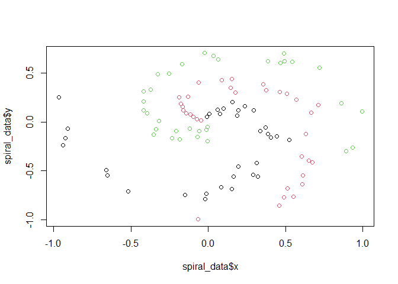

part2
================
Hans Elliott
4/13/2022

# Chapter 11: It’s Learning

First, I turn the spiral data generation into a callable function so we
can easily mess with the scale of the data. (Idea courtesy of NNFS of
course)

``` r
## Creating Data
# Source:
sim_data_fn = function(
  N = 100, # number of points per class
  D = 2, # dimensionality (number of features)
  K = 3, # number of classes
  random_order = FALSE
){
set.seed(123)
   X = data.frame() # data matrix (each row = single sample)
   y = data.frame() # class labels

for (j in (1:K)){
  r = seq(0.05,1,length.out = N) # radius
  t = seq((j-1)*4.7,j*4.7, length.out = N) + rnorm(N, sd = 0.3) # theta
  Xtemp = data.frame(x =r*sin(t) , y = r*cos(t)) 
  ytemp = data.frame(matrix(j, N, 1))
  X = rbind(X, Xtemp)
  y = rbind(y, ytemp)
  }
spiral_data = cbind(X,y)
colnames(spiral_data) = c(colnames(X), 'label')

# Want randomly ordered labels?
if (random_order==TRUE) {spiral_data$label = sample(1:3, size = N*K, 
                                                    replace = TRUE)}
return(spiral_data)
}
```

``` r
### Initialize Parameters for a Layer
init_params = function(n_inputs = "# of features", n_neurons){
        
    weights = matrix(data = (0.1 * rnorm(n = n_inputs*n_neurons)),
                             nrow = n_inputs, ncol = n_neurons)
           #Number of weights = the number of inputs*number of neurons,
           #since every connection between the previous neurons (from input) and
           #the current neurons have an associated weight
    biases = matrix(data = 0, nrow = 1, ncol = n_neurons)
           #Number of biases = the number
    #saves:
    list("weights"=weights, "biases"=biases)
}


### Dense Layers ----
layer_dense = list(
## FORWARD PASS FUNCTION 
 forward = function(    #default vals for weights/biases are random
            inputs, 
            n_neurons, 
            parameters
            #weights = 
            #    matrix(data = (0.10 * rnorm(n = ncol(inputs)*n_neurons)),
            #                 nrow = ncol(inputs), ncol = n_neurons), 
            #biases = 
            #    matrix(data = 0, nrow = 1, ncol = n_neurons)
 ) {#begin fn
   
  n_inputs = ncol(inputs)
      #determine number of inputs per sample from dims of the input matrix
      #should be equal to # of features (i.e, columns) in a sample (i.e, a row)
  
  #Initalize Weights and Biases
  #if (exists("new_weights")){
  #  weights = new_weights
  #} else {
  #  weights = matrix(data = (0.10 * rnorm(n = n_inputs*n_neurons)),
  #                   nrow = n_inputs, ncol = n_neurons)
  #}
       #Number of weights = the number of inputs*number of neurons. 
       #(Random numbers multipled by 0.10 to keep small.)
  #if (exists("new_biases")){
  #  biases = new_biases
  #} else {
  #  biases = matrix(data = 0, nrow = 1, ncol = n_neurons)
  #}
       #bias will have shape 1 by number of neurons. we initialize with zeros
 weights = parameters$weights
 biases = parameters$biases
 #Forward Pass 
 output = inputs%*%weights + biases[col(inputs%*%weights)]
 
 #UPDATE: 
 #need to save the inputs for backprop, so we create a list of objects.
 
 list("output" = output, #for forward pass
      "inputs" = inputs, "weights"= weights, "biases" = biases) #for backprop
 #and prints output by default, but invisibly
 #invisible(output)

 },
## BACKWARD PASS
 backward = function(inputs, weights, dvalues){
    #Gradients on parameters
    dweights = t(inputs)%*%dvalues
    dbiases = colSums(dvalues)
    #Gradient on values
    dinputs = dvalues%*%t(weights) 
    #save:
    list("dinputs"=dinputs,
         "dweights"=dweights,
         "dbiases"=dbiases)
 }
 
)
### Activation Functions ----
## ReLU
activation_ReLU = list(
  #FORWARD PASS
  forward = function(input_layer){
    
    output = matrix(sapply(X = input_layer, 
                    function(X){max(c(0, X))}
                    ), 
                  nrow = nrow(input_layer), ncol = ncol(input_layer))
    #ReLU function coerced into a matrix so the shape
    #is maintained (it will be equivalent to that of the input shape)
    
    #Function saves:
    list("output" = output, "inputs" = input_layer)
    #And prints
    #invisible(output)
  },
  #BACKWARD PASS
  backward = function(inputs, dvalues){
    dinputs = dvalues
    dinputs[inputs <= 0] = 0
    #save:
    list("dinputs"=dinputs)
  }
)

## SoftMax
activation_Softmax = list(
  forward = function(inputs){
          #scale inputs
          max_value = apply(X = inputs, MARGIN = 2,  FUN = max)
          scaled_inputs = sapply(X = 1:ncol(inputs), 
                 FUN = function(X){
                    inputs[,X] - abs(max_value[X])})

          # exponetiate
          exp_values = exp(scaled_inputs)
          # normalize
          norm_base = matrix(rowSums(exp_values),
                             nrow = nrow(inputs), ncol = 1)
          probabilities = sapply(X = 1:nrow(inputs),
                          FUN = function(X){exp_values[X,]/norm_base[X,]}) 
          return(t(probabilities))
          #(transpose probabilities)
          },
  
  backward = function(softmax_output, dvalues){
    #*INCOMPLETE SECTION - don't use*
    #flatten output array
    flat_output = as.vector(softmax_output)
    
    #calculate jacobian matrix of output
    jacobian_matrix = diag(flat_output) - flat_output%*%t(flat_output)
    
    #calculate sample-wise gradient
    dinputs = jacobian_matrix%*%flat_dvalues
    
    
  }
)

### Loss ----
Categorical_CrossEntropy = list(
  #FORWARD PASS
  forward = function(y_pred = "softmax output", y_true = "targets"){
    
    #DETECT NUMBER OF SAMPLES
    samples = length(y_true)  

    #CLIP SAMPLES TO AVOID -Inf ERROR
    y_pred_clipped = ifelse(y_pred <= 1e-7, 1e-7, 
                        ifelse(y_pred >= (1-1e-7), (1-1e-7), y_pred))
    

    #DETERMINE IF Y_TRUE IS ONE-HOT-ENCODED AND SELECT CORRESPODNING CONFIDENCES
    confidences = ifelse(nrow(t(y_true)) == 1, 
      #if y_true is a single vector of labels (i.e, sparse), then confidences =
                    y_pred_clipped[cbind(1:samples, y_true)],
                      
                      ifelse(nrow(y_true) > 1,
                      #else, if y_true is one-hot encoded, then confidences =
                             rowSums(y_pred_clipped*y_true),
                             #else
                             "error indexing the predicted class confidences")
                  )
                    
    #CALC LOSS FOR EACH SAMPLE (ROW)
    neg_log_likelihoods = -log(confidences)
    return(neg_log_likelihoods)
    
  },
  #BACKWARD PASS
  backward = function(y_true, dvalues){
    #number of samples
    samples = length(dvalues)
    
    #number of labels
    labels = length(unique(dvalues[1,]))
    
    #if labels are sparse, turn them into one-hot encoded vector
    y_true = ifelse(#if
                    nrow(t(y_true)) ==1,
                    #one-hot-encode
                    y_true = do.call(rbind,
                                     lapply(X = y_true,
                                       function(X) as.integer(
                                          !is.na(match(unique(
                                          unlist(y_true)
                                                        ), X)
                                                ))
                                      )), 
                    #else
                    y_true)
    
    #calculate gradient
    dinputs = -y_true/dvalues
    #normalize gradient
    dinputs = dinputs/samples
    return(dinputs)
  }
)
#---
#Softmax X Cross Entropy- combined softmax activation
# & cross-entropy loss for faster backprop
activation_loss_SoftmaxCrossEntropy = list(
  #FORWARD PASS
  forward = function(inputs, y_true){
    #output layer's activation function
    softmax_out = activation_Softmax$forward(inputs)
    #calculate loss
    loss = Categorical_CrossEntropy$forward(softmax_out, y_true)
    #function saves:
    list("softmax_output"=softmax_out, "loss"=loss) 
  },
  #BACKWARD PASS
  backward = function(dvalues, y_true){
    
    #Detect number of samples
    if (is.vector(dvalues)) {      #if one sample
      samples = 1
    } else if (is.array(dvalues)) {  #else if multiple samples
      samples = nrow(dvalues)
    } else print("error checking shape of inputs")
    
    #Reverse One-Hot Encoding
    #if labels are one-hot encoded, turn them discrete values
     ##helper function 
    anti_ohe = function(y_true){
               unique_classes = ncol(y_true)
               samples = nrow(y_true)
               y_true_vec = as.vector(y_true)
                    
               class_key = rep(1:unique_classes, each = samples)
               y_true = class_key[y_true_vec==1]
                    #selects the classes that correspond to 1s in y_true vector
                    return(y_true)
                    }
     ##check & modify
    y_true = if(is.array(y_true)){ #if one-hot encoded
                    #change to sparse
                    anti_ohe(y_true)
              } else y_true
    
    #Calculate gradient
     #Copy so we can modify
     dinputs = dvalues
     #Calculate gradient
     #index the prediction array with the sample number and its
     #true value index, subtracting 1 from these values. Requires discrete,
     #not one-hot encoded, true labels (explaining the need for the above step)
     dinputs[cbind(1:samples, y_true)] = dinputs[cbind(1:samples, y_true)] - 1
     #Normalize gradient
     dinputs = dinputs/samples
    #save desired outputs
    list("dinputs" = dinputs, "samples" = samples, "y_true" = y_true)
  }
)
```

``` r
optimizer_SGD = list(
  update_params = function(layer_forward, layer_backward, 
                           learning_rate = 1){ #default value
    #current params
    current_weights = layer_forward$weights
    current_biases = layer_forward$biases
    #gradients
    weight_gradients = layer_backward$dweights
    bias_gradients = layer_backward$dbiases
    #update
    weights = current_weights - learning_rate*weight_gradients
    biases = current_biases - learning_rate*bias_gradients
      #save:
      list("weights" = weights, "biases" = biases)
  }
)
```

First, note that I’ve added a parameter initialization stage that occurs
outside of the loop. The resulting list of parameter objects is then
passed into each corresponding layer.

    init_params = function(n_inputs = "# of features", n_neurons){
            
        weights = matrix(data = (0.1 * rnorm(n = n_inputs*n_neurons)),
                                 nrow = n_inputs, ncol = n_neurons)
               #Number of weights = the number of inputs*number of neurons,
               #since every connection between the previous neurons (from input) and
               #the current neurons have an associated weight
        biases = matrix(data = 0, nrow = 1, ncol = n_neurons)
               #Number of biases = the number
        #saves:
        list("weights"=weights, "biases"=biases)
    }

**EPOCH LOOP**  
Note: I use a learning rate of 1 here, which is equivalent to no
learning rate.

``` r
set.seed(1) ##set seed for results replication

#Inputs
spiral_data = sim_data_fn(N=33) #33 obs per class, total of 99 obs.
spiral_X = spiral_data[,c("x","y")]
spiral_X = as.matrix(spiral_X)

#Initalize Weights & Biases Outside of Loop
l1_params = init_params(n_inputs = 2,      ## ncol(spiral_X) would also work
                         n_neurons = 64)   ## = to desired # neurons in layer 
l2_params = init_params(n_inputs = 64,     ## = to n_neurons in prior layer
                         n_neurons = 3)    ## = to desired # neurons in layer

# EPOCH LOOP
tot_epochs = 1500L

for (epoch in 1:tot_epochs) {
#forward
layer1 = layer_dense$forward(inputs = spiral_X, 
                             n_neurons = 64,
                             parameters = l1_params)
                                    #weights = l1_params$weights,
                                     # biases = l1_params$biases)
  layer1_relu = activation_ReLU$forward(input_layer = layer1$output)
      layer2 = layer_dense$forward(inputs = layer1_relu$output, 
                                   n_neurons = 3,
                                   parameters = l2_params)
          output = 
          activation_loss_SoftmaxCrossEntropy$forward(inputs = layer2$output,
                                                  y_true = spiral_data$label)
              #metrics:
              LOSS = output$loss
              PRED = max.col(output$softmax_output, ties.method = "random") 
              ACC = mean(PRED==spiral_data$label)

          #backward
          loss_softm_b = activation_loss_SoftmaxCrossEntropy$backward(
                                      dvalues = output$softmax_output, 
                                      y_true = spiral_data$label)
      l2_b = layer_dense$backward(inputs = layer2$inputs,
                            weights = layer2$weights,
                            dvalues = loss_softm_b$dinputs)
  l1_relu_b = activation_ReLU$backward(inputs = layer1_relu$inputs,
                                       dvalues = l2_b$dinputs)     
l1_b = layer_dense$backward(inputs = layer1$inputs,
                            weights = layer1$weights,
                            dvalues = l1_relu_b$dinputs)      

#optimize
l1_optim_params = optimizer_SGD$update_params(layer_forward = layer1,
                                       layer_backward = l1_b,
                                       learning_rate = 1)
                                       
l2_optim_params = optimizer_SGD$update_params(layer_forward = layer2,
                                       layer_backward = l2_b,
                                       learning_rate = 1)
#update weights & biases
l1_params = l1_optim_params
l2_params = l2_optim_params

#repeat w new weights & biases
##  
#Status Report:
  if (epoch == 1){print(c("epoch","ovrflw err","loss","accuracy"))}
  if (epoch %in% seq(0,tot_epochs,by=100)){
        print(c( epoch, 
                 sum(is.nan(output$softmax_output)),#make sure NaN error is gone
                 LOSS,
                 ACC) )}


#Save Final Metrics:
  if (epoch==tot_epochs){
             out = list("loss"=LOSS,
                         "accuracy"=ACC,
                         "predictions"=PRED)}
}#end loop
```

    ## [1] "epoch"      "ovrflw err" "loss"       "accuracy"  
    ## [1] 100.0000000   0.0000000   1.0764161   0.5151515
    ## [1] 200.0000000   0.0000000   0.7036292   0.7979798
    ## [1] 300.0000000   0.0000000   0.8327823   0.8686869
    ## [1] 400.0000000   0.0000000   1.0673368   0.9191919
    ## [1] 500.0000000   0.0000000   0.2780790   0.8888889
    ## [1] 600.0000000   0.0000000   0.2163087   0.9090909
    ## [1] 700.0000000   0.0000000   0.6036958   1.0000000
    ## [1] 800.0000000   0.0000000   0.2683381   0.9898990
    ## [1] 900.0000000   0.0000000   0.6086284   1.0000000
    ## [1] 1000.0000000    0.0000000    0.4909734    1.0000000
    ## [1] 1100.0000000    0.0000000    0.4200253    1.0000000
    ## [1] 1200.0000000    0.0000000    0.3781748    1.0000000
    ## [1] 1300.0000000    0.0000000    0.2947625    1.0000000
    ## [1] 1400.0000000    0.0000000    0.5265075    1.0000000
    ## [1] 1500.0000000    0.0000000    0.4006435    1.0000000

``` r
out$loss
```

    ## [1] 0.4006435

``` r
out$accuracy
```

    ## [1] 1

``` r
out$predictions
```

    ##  [1] 1 1 1 1 1 1 1 1 1 1 1 1 1 1 1 1 1 1 1 1 1 1 1 1 1 1 1 1 1 1 1 1 1 2 2 2 2 2
    ## [39] 2 2 2 2 2 2 2 2 2 2 2 2 2 2 2 2 2 2 2 2 2 2 2 2 2 2 2 2 3 3 3 3 3 3 3 3 3 3
    ## [77] 3 3 3 3 3 3 3 3 3 3 3 3 3 3 3 3 3 3 3 3 3 3 3

Wow! The neural net was able to almost perfectly learn the labels of the
spiral data in under 1000 epochs. Of course this wasn’t a very difficult
dataset for the model to learn, but we’ve come a long way.  
A note: In a previous attempt, I trained the model on a dataset of 300
obs. and with a learning rate of 1, the NN broke down after about 1000
epochs. Specifically, it became filled with NaN values, rendering it
useless. I’m guessing that this is related to exploding gradients. I
stopped the NN around epoch 900 and found that the size of the weights
had grown to be quite large. By about epoch 1000, it would start
returning NaN values. This can be solved using a lower learning rate
(e.g, 0.5 worked). In practice, a learning rate of 1 is quite high,
allowing every step in the gradient descent process to be rather large,
directly leading to gradient explosion (NNFS, Ch. 10 pg 24). This
problem is relatively common and can be solved in [various
ways](https://machinelearningmastery.com/exploding-gradients-in-neural-networks/).
My initial tendency is to re-code something so that this simply cannot
happen, which points towards *gradient clipping* or *weight
regularization*, but alternative options (lower learning rates or
reshuffling the shape of the network) are also viable solutions, so I
won’t touch anything for now.  
Either way, this is a good segue into adding some further hyperparameter
options to the Neural Network.

``` r
#Actual
plot(spiral_data$x, spiral_data$y, col = spiral_data$label)
#Predicted
plot(spiral_data$x, spiral_data$y, col = out$predictions)
```

<!-- -->

# Chapter 12: Hyperparameters

## Learning Rate Decay

Learning rate decay describes a process whereby the learning rate
decreases during the course of model training. This could be achieved by
programmatically or manually adjusting the learning rate when the
model’s loss plateaus or begins jumping randomly.  
It could also be achieved by programming a simple **Decay Rate**, which
lowers the learning rate each epoch or each batch. This is also known as
1/t decaying or exponential decaying. For example:

``` r
start_learn_rate = 1
learn_rate_decay = 0.1
for (step in 1:20){
  learning_rate = start_learn_rate * (1 / (1 + learn_rate_decay*step))
                                      ## ensures that learn rate never gets >1
  print(learning_rate)
}
```

    ## [1] 0.9090909
    ## [1] 0.8333333
    ## [1] 0.7692308
    ## [1] 0.7142857
    ## [1] 0.6666667
    ## [1] 0.625
    ## [1] 0.5882353
    ## [1] 0.5555556
    ## [1] 0.5263158
    ## [1] 0.5
    ## [1] 0.4761905
    ## [1] 0.4545455
    ## [1] 0.4347826
    ## [1] 0.4166667
    ## [1] 0.4
    ## [1] 0.3846154
    ## [1] 0.3703704
    ## [1] 0.3571429
    ## [1] 0.3448276
    ## [1] 0.3333333

We will simply add this as an optional hyperparameter to our SGD
optimizer. Since I’m currently going with the for loop method, iteration
will just be set equal to the current epoch.  
The default values ensure that if we decided to ignore decay, it will
not affect the learning rate.

``` r
optimizer_SGD = list(
  update_params = function(layer_forward, layer_backward, 
                           learning_rate = 1,
                           decay = 0, iteration = 1){ #default values
    #current params
    current_weights = layer_forward$weights
    current_biases = layer_forward$biases
    #gradients
    weight_gradients = layer_backward$dweights
    bias_gradients = layer_backward$dbiases
    
    #learning rate
    currnt_learn_rate = learning_rate * (1 / (1 + decay*iteration)) 
    
    #update
    weights = current_weights - currnt_learn_rate*weight_gradients
    biases = current_biases - currnt_learn_rate*bias_gradients
      #save:
      list("weights" = weights, "biases" = biases, "lr" = currnt_learn_rate)
  }
)
```

Here I implement our training loop using a decay rate of 0.001, starting
with a learning rate of 1. I train the model to learn a dataset of 300
observations, which previously did not work with the high learning rate
due to exploding gradients.  
Adding the decay rate solved this exploding gradients issue, and the
model trains successfully for 1500 epochs.

``` r
set.seed(1) ##set seed for results replication

#Inputs
spiral_data = sim_data_fn(N=100) #100 obs per class, total of 300 samples
spiral_X = spiral_data[,c("x","y")] #leave out label
spiral_X = as.matrix(spiral_X)

#Initalize Weights & Biases Outside of Loop
l1_params = init_params(n_inputs = 2,      ## ncol(spiral_X) would also work
                         n_neurons = 64)   ## = to desired # neurons in layer 
l2_params = init_params(n_inputs = 64,     ## = to n_neurons in prior layer
                         n_neurons = 3)    ## = to desired # neurons in layer

# EPOCH LOOP
tot_epochs = 1500L

for (epoch in 1:tot_epochs) {
#forward
layer1 = layer_dense$forward(inputs = spiral_X, 
                             n_neurons = 64,
                             parameters = l1_params)
  layer1_relu = activation_ReLU$forward(input_layer = layer1$output)
      layer2 = layer_dense$forward(inputs = layer1_relu$output, 
                                   n_neurons = 3,
                                   parameters = l2_params)
          output = 
          activation_loss_SoftmaxCrossEntropy$forward(inputs = layer2$output,
                                                  y_true = spiral_data$label)
              #metrics:
              LOSS = output$loss
              PRED = max.col(output$softmax_output, ties.method = "random") 
              ACC = mean(PRED==spiral_data$label)

          #backward
          loss_softm_b = activation_loss_SoftmaxCrossEntropy$backward(
                                      dvalues = output$softmax_output, 
                                      y_true = spiral_data$label)
      l2_b = layer_dense$backward(inputs = layer2$inputs,
                            weights = layer2$weights,
                            dvalues = loss_softm_b$dinputs)
  l1_relu_b = activation_ReLU$backward(inputs = layer1_relu$inputs,
                                       dvalues = l2_b$dinputs)     
l1_b = layer_dense$backward(inputs = layer1$inputs,
                            weights = layer1$weights,
                            dvalues = l1_relu_b$dinputs)      

#optimize
l1_optim_params = optimizer_SGD$update_params(layer_forward = layer1,
                                       layer_backward = l1_b,
                                       learning_rate = 1,
                                       decay = .001,iteration = epoch
                                       )
l2_optim_params = optimizer_SGD$update_params(layer_forward = layer2,
                                       layer_backward = l2_b,
                                       learning_rate = 1,
                                       decay = .001, iteration = epoch)
#update weights & biases
l1_params = l1_optim_params
l2_params = l2_optim_params

#repeat w new weights & biases
##  
#Status Report:
  if (epoch == 1){print(c("epoch","ovrflw err","loss","accuracy", "learn rate"))}
  if (epoch %in% seq(0,tot_epochs,by=100)){
        print(c( epoch, 
                 sum(is.nan(output$softmax_output)),#make sure NaN error is gone
                 LOSS,
                 ACC,
                 l1_optim_params$lr) )} #(include learn rate)


#Save Final Metrics:
  if (epoch==tot_epochs){
             out = list("loss"=LOSS,
                         "accuracy"=ACC,
                         "predictions"=PRED)}
}#end loop
```

    ## [1] "epoch"      "ovrflw err" "loss"       "accuracy"   "learn rate"
    ## [1] 100.0000000   0.0000000   1.1632978   0.5666667   0.9090909
    ## [1] 200.0000000   0.0000000   0.5465526   0.7533333   0.8333333
    ## [1] 300.0000000   0.0000000   1.2644167   0.8166667   0.7692308
    ## [1] 400.0000000   0.0000000   0.2649515   0.7500000   0.7142857
    ## [1] 500.00000000   0.00000000   0.05994289   0.75666667   0.66666667
    ## [1] 600.0000000   0.0000000   0.9089303   0.9000000   0.6250000
    ## [1] 700.0000000   0.0000000   1.4314442   0.9266667   0.5882353
    ## [1] 800.0000000   0.0000000   0.6604971   0.9533333   0.5555556
    ## [1] 900.0000000   0.0000000   0.3750754   0.9533333   0.5263158
    ## [1] 1000.0000000    0.0000000    0.5972036    0.9800000    0.5000000
    ## [1] 1100.0000000    0.0000000    0.6283397    0.9800000    0.4761905
    ## [1] 1200.0000000    0.0000000    0.6141455    0.9833333    0.4545455
    ## [1] 1300.0000000    0.0000000    0.5943458    0.9833333    0.4347826
    ## [1] 1400.0000000    0.0000000    0.5585043    0.9833333    0.4166667
    ## [1] 1500.0000000    0.0000000    0.5581821    0.9833333    0.4000000

The learning rate decreases quite quickly, but this seems to work.
Rather than losing control, the NN steadily decreases the loss and
reaches an accuracy of 98%, which is much better than random guessing.
It seems to get stuck in a local minimum by the 1000th epoch.

## Momentum

Momentum allows the size and direction of each “downward” step in
gradient descent to depend upon the size and direction of prior steps.
This can help the model pass through local loss minimums, making it more
likely that a global minimum is found. I find this easiest to understand
[visually](https://nnfs.io/jog/). You can see how the change in the loss
function “speeds up” when loss is decreasing rapidly, and slows down
when loss starts increasing.  
To actually implement this method, we will allow some fraction of the
previous parameter updates (i.e, the changes to weights & biases) to be
combined with a fraction of the current parameter updates. Thus, the
portion of the gradient from preceding steps - the direction of change
decided in previous epochs - determines the actual momentum.  
Now, we can add this as a hyperparameter. Due to how I am executing my
loop and updating parameters within the loop, I’ve decided to implement
momentum as an option in the paramter initialization function. If set to
`TRUE`, the function will generate a matrix of zeros of the right shape.

``` r
init_params = function(n_inputs = "# of features",
                       n_neurons,
                       momentum = FALSE){
        
    weights = matrix(data = (0.1 * rnorm(n = n_inputs*n_neurons)),
                             nrow = n_inputs, ncol = n_neurons)
           #Number of weights = the number of inputs*number of neurons,
           #since every connection between the previous neurons (from input) and
           #the current neurons have an associated weight
    biases = matrix(data = 0, nrow = 1, ncol = n_neurons)
           #Number of biases = the number
    
    #momentum initialization
    if (momentum == TRUE){
          weight_momentums = matrix(data = 0, 
                                    nrow = nrow(weights),
                                    ncol = ncol(weights))
          bias_momentums = matrix(data = 0,
                                  nrow = nrow(biases),
                                  ncol = ncol(biases))
          #save:
          list("weights"=weights,"biases"=biases,
               "weight_momentums"=weight_momentums,
               "bias_momentums"=bias_momentums)
    } else {
    #save:
    list("weights"=weights, "biases"=biases) }
}
```

Now we can update the SGD optimizer to utilize momentum. If the momentum
rate is set above 0 (should be between 0 and 1), then the optimizer will
update weights and biases using the momentum method. This will work
*only if* momentum was enabled in the parameter initialization function
(above).  
If momentum was enabled but the rate stays at zero, the optimizer will
still calculate the updates using the momentum method but this will be
equivalent to the “vanilla” method.

``` r
optimizer_SGD = list(
  update_params = function(layer_forward, layer_backward, #required
                           learning_rate = 1,
                           decay = 0, iteration = 1,
                           momentum_rate = 0 
                           ){
    #current params
    current_weights = layer_forward$weights
    current_biases = layer_forward$biases
    #gradients
    weight_gradients = layer_backward$dweights
    bias_gradients = layer_backward$dbiases
    
    #learning rate
    currnt_learn_rate = learning_rate * (1 / (1 + decay*iteration)) 
    
    #param updates with momentum
     #If momentum == TRUE in parameter initialization, then weights_momentum
     #(and implictly, bias_momentum) will exist
    if (exists("weight_momentums", where = layer_forward)) {
      #current momentums
      weight_momentums = layer_forward$weight_momentums
      bias_momentums = layer_forward$bias_momentums
      
      #Update weights & biases with momentum:
      #Take prior updates X retainment factor (the "momentum rate"),
      #and update with current gradients
      weight_update = 
        (momentum_rate*weight_momentums) - (currnt_learn_rate*weight_gradients)
      bias_update = 
        (momentum_rate*bias_momentums) - (currnt_learn_rate*bias_gradients)
      #update params with the calculated updates
      weights = current_weights + weight_update
      biases = current_biases + bias_update
      #also update momentums
      weight_momentums = weight_update
      bias_momentums = bias_update
      #save:
      list("weights" = weights, "biases" = biases, "lr" = currnt_learn_rate,
           "weight_momentums" = weight_momentums, 
           "bias_momentums" = bias_momentums)
    } else {
      
    #param updates without momentum (vanilla)
      #calculate updates
      weight_update = -currnt_learn_rate*weight_gradients
      bias_update = -currnt_learn_rate*bias_gradients
      #apply updates
      weights = current_weights + weight_update
      biases = current_biases + bias_update
      #save:
      list("weights" = weights, "biases" = biases, "lr" = currnt_learn_rate)
    }
    
}
)
```

Finally, in order for this to all work seamlessly we need to update the
layer_dense function to store `weight_momentums` and `bias_momentums`
when momentum is enabled. Above and below you can see that I utilized
the base::exists() function. In these cases, it is telling R to look for
an object called “weights_momentums” within the parameters object. If it
exists (which it will if momentum is enabled in the param initialization
function) then each layer will store the matrices of momentums.

``` r
### Dense Layers ----
layer_dense = list(
## FORWARD PASS FUNCTION 
 forward = function(    #default vals for weights/biases are random
            inputs, 
            n_neurons, 
            parameters
 ) {#begin fn
   
 n_inputs = ncol(inputs)
 weights = parameters$weights
 biases = parameters$biases
 #Forward Pass 
 output = inputs%*%weights + biases[col(inputs%*%weights)]
 
 #If momentum == TRUE in parameter initialization, then layer saves:
 if (exists(x = "weight_momentums", where = parameters)){
 list("output" = output, ##for forward pass
      "inputs" = inputs, "weights"= weights, "biases" = biases, ##for backprop
      "weight_momentums"=parameters$weight_momentums, ##for momentum
      "bias_momentums"=parameters$bias_momentums
      )
 } else { #otherwise, just save
 list("output" = output, ##for forward pass
      "inputs" = inputs, "weights"= weights, "biases" = biases) ##for backprop
  }
},#end fwd

## BACKWARD PASS
 backward = function(inputs, weights, dvalues){
    #Gradients on parameters
    dweights = t(inputs)%*%dvalues
    dbiases = colSums(dvalues)
    #Gradient on values
    dinputs = dvalues%*%t(weights) 
    #save:
    list("dinputs"=dinputs,
         "dweights"=dweights,
         "dbiases"=dbiases)
 }
 
)#end list
```

Okay, to sum up what just happened here:  
If we want to use momentum, we set momentum==TRUE in the paramter
intialization stage. Then, when the params are passed into the layer
objects, their will exists objects that correspond to matrices for the
weights and bias momentums. Since these objects exist, the layer
function will save them.  
Then, when the layer is passed into the optimizer in the “layer_forward”
option, the optimizer will detect the existence of the momentum objects
and use them to calculate updates with momentums. It will also use
whatever momentum_rate the user sets. Let’s try it:

``` r
set.seed(1) ##set seed for results replication

#Inputs
spiral_data = sim_data_fn(N=100) #100 obs per class, total of 300 samples
spiral_X = spiral_data[,c("x","y")] #leave out label
spiral_X = as.matrix(spiral_X)

#Initalize Weights & Biases Outside of Loop
l1_params = init_params(n_inputs = 2,     ## ncol(spiral_X) would also work
                        n_neurons = 64,   ## = to desired # neurons in layer 
                        momentum = TRUE)
l2_params = init_params(n_inputs = 64,    ## = to n_neurons in prior layer
                        n_neurons = 3,    ## = to desired # neurons in layer
                        momentum = TRUE)

# EPOCH LOOP
tot_epochs = 2000L

for (epoch in 1:tot_epochs) {
#forward
layer1 = layer_dense$forward(inputs = spiral_X, 
                             n_neurons = 64,
                             parameters = l1_params)
  layer1_relu = activation_ReLU$forward(input_layer = layer1$output)
      layer2 = layer_dense$forward(inputs = layer1_relu$output, 
                                   n_neurons = 3,
                                   parameters = l2_params)
          output = 
          activation_loss_SoftmaxCrossEntropy$forward(inputs = layer2$output,
                                                  y_true = spiral_data$label)
              #metrics:
              LOSS = output$loss
              PRED = max.col(output$softmax_output, ties.method = "random") 
              ACC = mean(PRED==spiral_data$label)

          #backward
          loss_softm_b = activation_loss_SoftmaxCrossEntropy$backward(
                                      dvalues = output$softmax_output, 
                                      y_true = spiral_data$label)
      l2_b = layer_dense$backward(inputs = layer2$inputs,
                            weights = layer2$weights,
                            dvalues = loss_softm_b$dinputs)
  l1_relu_b = activation_ReLU$backward(inputs = layer1_relu$inputs,
                                       dvalues = l2_b$dinputs)     
l1_b = layer_dense$backward(inputs = layer1$inputs,
                            weights = layer1$weights,
                            dvalues = l1_relu_b$dinputs)      

#optimize
l1_optim_params = optimizer_SGD$update_params(layer_forward = layer1,
                                       layer_backward = l1_b,
                                       learning_rate = 1,
                                       decay = .001,iteration = epoch,
                                       momentum_rate = 0.5)
l2_optim_params = optimizer_SGD$update_params(layer_forward = layer2,
                                       layer_backward = l2_b,
                                       learning_rate = 1,
                                       decay = .001, iteration = epoch,
                                       momentum_rate = 0.5)
#update weights & biases
l1_params = l1_optim_params
l2_params = l2_optim_params

  #repeat w new weights,biases, & momentums...
##  
#Status Report:
  if (epoch == 1){print(c("epoch","ovrflw err","loss","accuracy", "learn rate"))}
  if (epoch %in% seq(0,tot_epochs,by=100)){
        print(c( epoch, 
                 sum(is.nan(output$softmax_output)),#make sure NaN error is gone
                 LOSS,
                 ACC,
                 l1_optim_params$lr) )} #(include learn rate)


#Save Final Metrics:
  if (epoch==tot_epochs){
             out = list("loss"=LOSS,
                         "accuracy"=ACC,
                         "predictions"=PRED)}
}#end loop
```

    ## [1] "epoch"      "ovrflw err" "loss"       "accuracy"   "learn rate"
    ## [1] 100.0000000   0.0000000   0.8319958   0.8000000   0.9090909
    ## [1] 200.0000000   0.0000000   1.8526822   0.6666667   0.8333333
    ## [1] 3.000000e+02 0.000000e+00 7.444755e-03 6.000000e-01 7.692308e-01
    ## [1] 400.0000000   0.0000000   2.0094120   0.8700000   0.7142857
    ## [1] 500.0000000   0.0000000   0.3223337   0.9466667   0.6666667
    ## [1] 600.0000000   0.0000000   0.4249130   0.8966667   0.6250000
    ## [1] 700.0000000   0.0000000   0.6736793   0.9766667   0.5882353
    ## [1] 800.0000000   0.0000000   0.3634260   0.9833333   0.5555556
    ## [1] 900.0000000   0.0000000   0.3204776   0.9833333   0.5263158
    ## [1] 1000.0000000    0.0000000    0.2798305    0.9833333    0.5000000
    ## [1] 1100.0000000    0.0000000    0.2468011    0.9866667    0.4761905
    ## [1] 1200.0000000    0.0000000    0.2218942    0.9933333    0.4545455
    ## [1] 1300.0000000    0.0000000    0.2032342    0.9933333    0.4347826
    ## [1] 1400.0000000    0.0000000    0.1872933    0.9933333    0.4166667
    ## [1] 1500.0000000    0.0000000    0.1787252    0.9933333    0.4000000
    ## [1] 1600.0000000    0.0000000    0.1726439    0.9933333    0.3846154
    ## [1] 1700.0000000    0.0000000    0.1659342    0.9933333    0.3703704
    ## [1] 1800.0000000    0.0000000    0.1588965    0.9933333    0.3571429
    ## [1] 1900.0000000    0.0000000    0.1529867    0.9933333    0.3448276
    ## [1] 2000.0000000    0.0000000    0.1486481    0.9933333    0.3333333

Adding momentum gave us a slight boost. We managed to get out of the
local minimum and this improved the accuracy. 0.9933 corresponds to
298/300 correctly classified samples.

``` r
#Actual
plot(spiral_data$x, spiral_data$y, col = spiral_data$label)
```

<!-- -->

``` r
#Predicted
plot(spiral_data$x, spiral_data$y, col = out$predictions)
```

<!-- -->

# The AdaGrad Optimizer

AdaGrad, or adaptive gradient, uses a “per-parameter” learning rate
rather than a globally shared one, as we used with the SGD optimizer.

<https://www.r-bloggers.com/2016/01/strategies-to-speedup-r-code/>
