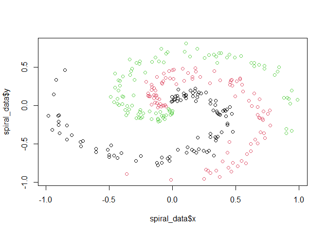

Neural Network from Scratch - R
================
Hans Elliott
3/26/2022

In this document I will attempt to build a neural net from scratch.  
I am following along to this video: , which is based on this
[book](https://nnfs.io/). And adapting the code from Python to R.

## Part 1: Inputs & Outputs

\*Note: the numbers in these beginning sections (for the inputs,
weights, & biases) have no meaning. We start by understanding and
building the smallest components of a neural net and work our way to the
bigger picture.  
In reality, inputs are determined by the data that is fed to the NN.
Weights and biases are initialized randomly, and then tuned through the
NN’s training process. It’s useful to just make up some numbers for now.

``` r
inputs = c(1, 2, 3)
weights = c(0.2, 0.8, -0.5)
bias = 2


# this is the equivalent of a single neuron in a 'hidden' layer
# the inputs and the weights are comined (plus bias) to get the final output for the neuron
output = 
  inputs[1]*weights[1] + inputs[2]*weights[2] + inputs[3]*weights[3] + bias

# the inputs could be from the 'input layer', values from our raw dataset, or they could be outputs from the previous 'hidden layer'
```

What if we wanted to model 3 neurons (a layer) with 4 inputs?

``` r
#still have 4 inputs
inputs = c(1, 2, 3, 2.5)
#need 3 weight sets
weights1 = c(0.2, 0.8, -0.5, 1.0)
weights2 = c(0.5, -0.91, 0.26, -0.5)
weights3 = c(-0.26, -0.27, 0.17, 0.87)
#and 3 biases
bias1 = 2
bias2 = 3
bias3 = 0.5

#Our output will a list of (3) outputs now, since we are modeling an output layer of 3 neurons
output = 
c(inputs[1]*weights1[1] + inputs[2]*weights1[2] + 
    inputs[3]*weights1[3] + inputs[4]*weights1[4] + bias1, #first neuron output
  inputs[1]*weights2[1] + inputs[2]*weights2[2] + 
    inputs[3]*weights2[3] + inputs[4]*weights2[4] + bias2, #second neuron output
  inputs[1]*weights3[1] + inputs[2]*weights3[2] + 
    inputs[3]*weights3[3] + inputs[4]*weights3[4] + bias3  #third neuron output
  )
output
```

    ## [1] 4.800 1.210 2.385

Key takeaway - any given neuron takes some set of inputs, multiplies
them by the predetermined weights (these will be set randomly and then
**learned/tuned** through training), and adds the bias (also learned
through training).  
This results in an output.  
We saw how to code this for a single neuron, receiving 3 inputs (I like
to think of this as if we fed the neuron *1 row* from a tabular
dataframe with *3 columns*.)  
Then we saw how this would look for a **layer**, that is multiple
neurons receiving the same set of inputs, and each performing the input
-\> output process described above.  
Insights - if we had just one hidden layer and were predicting 3
outputs, like in the second code chunk, these output would be our 3
predicted values for the 3x3 dataframe. So how would we change these
predictions?? By tweaking the weights and the bias for each individual
neuron - after all, those are the only things modifying the inputs after
they’re fed into the neuron!

## Part 2: The Building Blocks

### 2.1 Arrays, Matrices, & Shape

``` r
# A Vector
my_list = list(3,5,1,2) #mathematically this list of numbers = a vector,
                          #in machine learning, it is often called an array
class(my_list)          #to r, it is a list
```

    ## [1] "list"

``` r
  my_list2 = c(3,5,1,2)   #c() combines arguments into a vector/list
  class(my_list2)         #but to r, it is not a 'list' class
```

    ## [1] "numeric"

``` r
# Shape
# For deep learning we need to know about shape. In Python, shape is the term describing the dimensions of an array or matrix. In R, dimensions or dim() tends to be the word of choice.
  
  #This is a 1 dimensional array, with shape = (4,) - since it has 4 elements, and is 1 dimensional.
my_list = list(3,5,1,2)
length(my_list) #(for 1d lists, we use length() in R)
```

    ## [1] 4

``` r
#This is a 2 dimensional array, or a matrix, with shape = (2, 4)
list_of_lists = rbind(c(3,5,1,2), 
                      c(1,5,6,3))
dim(list_of_lists)
```

    ## [1] 2 4

``` r
  #note: we need to use the rbind() function here. if we use list() or c() it won't work.
  #if we wanted, we could use the matrix() function to create the matrix. But that requires specifying the data, and is harder to visualize. Read more here: https://www.datamentor.io/r-programming/matrix/
  #to compare:
not_a_lol = list(c(3,5,1,2),
              c(1,5,6,3))
not_a_lol; list_of_lists
```

    ## [[1]]
    ## [1] 3 5 1 2
    ## 
    ## [[2]]
    ## [1] 1 5 6 3

    ##      [,1] [,2] [,3] [,4]
    ## [1,]    3    5    1    2
    ## [2,]    1    5    6    3

``` r
#This is a three dimensional array, with shape = (2, 4, 3) - (a list of lists, within a list - a lolol)
lolol = array(data = 1:24, dim = c(2, 4, 3))
dim(lolol)
```

    ## [1] 2 4 3

``` r
lolol
```

    ## , , 1
    ## 
    ##      [,1] [,2] [,3] [,4]
    ## [1,]    1    3    5    7
    ## [2,]    2    4    6    8
    ## 
    ## , , 2
    ## 
    ##      [,1] [,2] [,3] [,4]
    ## [1,]    9   11   13   15
    ## [2,]   10   12   14   16
    ## 
    ## , , 3
    ## 
    ##      [,1] [,2] [,3] [,4]
    ## [1,]   17   19   21   23
    ## [2,]   18   20   22   24

A tensor is an object that *can* be represented as an array. For our
machine learning purposes, tensors will be an array.

### 2.2: Dot Product

``` r
a = c(1, 2, 3)
b = c(2, 3, 4)

dot_product = a[1]*b[1] + a[2]*b[2] + a[3]*b[3]
dot_product
```

    ## [1] 20

Going back to our neuron code…  
A single neuron

``` r
inputs = c(1, 2, 3, 2.5)
weights = c(0.2, 0.8, -0.5, 1.0)
bias = 2

#The dot product of two vectors is calculated by multiplying them element-wise with * then summing the result. Two ways to do this in R:
#Output =
 sum(weights*inputs) + bias #OR
```

    ## [1] 4.8

``` r
 weights%*%inputs + bias
```

    ##      [,1]
    ## [1,]  4.8

A layer of neurons

``` r
inputs = c(1, 2, 3, 2.5)
weights = rbind(c(0.2, 0.8, -0.5, 1.0),
                c(0.5, -0.91, 0.26, -0.5),
                c(-0.26, -0.27, 0.17, 0.87))
biases = c(2, 3, 0.5)

#It is important that we write 'weights' first because:
# inputs is a vector, but weights is a matrix. the first element written is how the output will
# be indexed. If we do the opposite, we will get an error.

output = weights%*%inputs + biases
output
```

    ##       [,1]
    ## [1,] 4.800
    ## [2,] 1.210
    ## [3,] 2.385

``` r
# What is really going on here? Consider that weights[1,], weights[2,], etc. are vectors themselves
weights[1,]
```

    ## [1]  0.2  0.8 -0.5  1.0

``` r
# so
c( (weights[1,]%*%inputs) + biases[1], 
   (weights[2,]%*%inputs) + biases[2], 
   (weights[3,]%*%inputs) + biases[3]
  )
```

    ## [1] 4.800 1.210 2.385

``` r
#really nothing crazy!
```

### 2.3: Batches

So far, our inputs have been a 1d array.  
We’re now going to be passing the neurons a batch, which is essentially
a 2d array (or matrix). Formally, the batch size is the number of
samples processed before the model is updated (with tabular data,
samples = rows). Why batch?  
- Generalization/external-validity/test performance. We’re going to
randomly provide our NN with a batch of samples instead of just feeding
it 1 sample at a time. This is easiest to understand visually:
<https://www.youtube.com/watch?v=TEWy9vZcxW4&ab_channel=sentdex&t=4m57s>.  
- Bonus: We can compute batches in parallel.

A layer of neurons

``` r
#lets code a 'batch' of inputs. this will be a list of lists
inputs = rbind(c(1.0, 2.0, 3.0, 2.5),
               c(2.0, 5.0, -1.0, 2.0),
               c(-1.5, 2.7, 3.3, -0.8)
               )
#the amount of weights & biases doesn't change, since they are associated with individual neurons and we are not chaning the number of neurons 
weights = rbind(c(0.2, 0.8, -0.5, 1.0),
                c(0.5, -0.91, 0.26, -0.5),
                c(-0.26, -0.27, 0.17, 0.87))

biases = c(2, 3, 0.5)
```

``` r
# now both weights and inputs are matrices, so we need to do matrix multiplication.
# inputs & weights are the same shape now, so we're going to run into an error if we try to use the dot-product %*%. This is due to how matrix multiplication works: https://www.mathsisfun.com/algebra/matrix-multiplying.html. The number of row-wise elements (4 in this case) needs to match the number of column-wise elements of the other matrix - which is 3, and thus they do not match.  
output = inputs%*%weights + biases
```

``` r
# Therefore, we need to TRANSPOSE one of the matrices. We're basically just going to make the first row our first column, the second row our second column, and the third row our third column. 
# transposing weights with t()
t(weights)
```

    ##      [,1]  [,2]  [,3]
    ## [1,]  0.2  0.50 -0.26
    ## [2,]  0.8 -0.91 -0.27
    ## [3,] -0.5  0.26  0.17
    ## [4,]  1.0 -0.50  0.87

``` r
output = inputs %*% t(weights) + biases[col(inputs%*%t(weights))] 
#Note: to add a row vector (biases) to a matrix, '+ biases' will not work in R
#there are a few options, see: https://stackoverflow.com/questions/39443055/add-a-vector-to-all-rows-of-a-matrix
#The above solution adds each element at the same index so if inputs%*%t(weights) = y,
            # y[1,1] + biases[1], y[1,2] + biases[2], y[1,3] + biases[3],
            # y[2,1] + biases[1], y[2,2] + biases[2], y[2,3] + biases[3],
            # y[3,1] + biases[1], y[3,2] + biases[2], y[3,3] + biases[3]
output
```

    ##      [,1]   [,2]  [,3]
    ## [1,] 4.80  1.210 2.385
    ## [2,] 8.90 -1.810 0.200
    ## [3,] 1.41  1.051 0.026

Review: Now that we’ve decided to feed batches of inputs into our NN,
the inputs are actually a 2d array or a matrix. Therefore, their shape
matches the shape of the weight matrix, and the two matrices cannot be
multiplied *unless* the weights matrix is transposed. One way to think
of this: - The *inputs* matrix has shape (3,4)  
- and the **weights** matrix has shape (3,4)  
- but the first element of the *inputs* batch (3)  
- needs to match the second element of the **weights** matrix (4 != 3)  
- thus we <span style="color:blue">transpose</span> the **weights**
matrix so that it has shape (4,3).

``` r
dim(inputs)
```

    ## [1] 3 4

``` r
dim(weights)
```

    ## [1] 3 4

``` r
dim(t(weights)) #transposed
```

    ## [1] 4 3

Lets try adding on some more layers:

``` r
inputs = rbind(c(1.0, 2.0, 3.0, 2.5),
               c(2.0, 5.0, -1.0, 2.0),
               c(-1.5, 2.7, 3.3, -0.8))

#for first layer
weights = rbind(c(0.2, 0.8, -0.5, 1.0),
                c(0.5, -0.91, 0.26, -0.5),
                c(-0.26, -0.27, 0.17, 0.87))

biases = c(2, 3, 0.5)
#for second layer
weights2 = rbind(c(0.1, -0.14, 0.5),
                c(-0.5, 0.12, -0.33),
                c(-0.44, 0.73, -0.13))
biases2 = c(-1, 2, -0.5)

#feed in input layer to first layer, apply weights and biases
layer1_outputs = inputs%*%t(weights) + biases[col(inputs%*%t(weights))]


#feed in layer 1's outputs as the inputs to layer 2, and apply layer 2 weights and biases
layer2_outputs = layer1_outputs%*%t(weights2) + biases2[col(layer1_outputs%*%t(weights2))]

#final outputs
layer2_outputs
```

    ##          [,1]     [,2]     [,3]
    ## [1,]  0.50310 -1.04185 -2.03875
    ## [2,]  0.24340 -2.73320 -5.76330
    ## [3,] -0.99314  1.41254 -0.35655

## 2.4: Creating a NN function

This code has been relatively simple, but its going to become cumbersome
as we scale up the size of the NN. To solve this, we take advantage of
Object-Oriented Programming and write a function.

``` r
set.seed(0) #setting a seed for results replication

#X = our feature set
X = rbind(c(1.0, 2.0, 3.0, 2.5),
          c(2.0, 5.0, -1.0, 2.0),
          c(-1.5, 2.7, 3.3, -0.8))

#Hidden layers
  # Weights: we randomly initialize weights (i.e., assign them a random number usually between -1 and 1, but smaller is better).
  # Biases: tend to initialize them as zero.


layer_dense = function(n_neurons, inputs){
  
  n_inputs = ncol(inputs)
  #specifies the number of inputs based on the dimensions (shape) of the input matrix
  #this should be equivalent to the number of features (i.e, columns) in a sample (i.e, a row)
  
#INITALIZE WEIGHTS AND BIASES
  weights = matrix(data = (0.10 * rnorm(n = n_inputs*n_neurons)),
                    nrow = n_inputs, ncol = n_neurons)
  #Number of weights = the number of inputs*number of neurons. 
    #(Multipled by 0.10 to keep small.)
  #In R, we need to convert this to a matrix (of the proper shape) manually.
  #NOTE: we've shaped our weights so that they have n_inputs rows and n_neurons columns,
  #     which means we will not have to transpose them every time we matrix multiply with 
  #     the input batch
  
  biases = matrix(data = 0, nrow = 1, ncol = n_neurons)
  #bias will have shape 1 by number of neurons. we intialize with zeros
  
#FORWARD PASS
  output = inputs%*%weights + biases[col(inputs%*%weights)]
  #again, the inputs will either be the input layer (our data, or X), or
  # they will be the outputs from the previous layer
}

#The result of the function will be to produce the outputs 
```

So we’ve built a layer function, lets try it:

``` r
#input X from above, and lets try 5 neurons
layer1 = layer_dense(inputs = X, n_neurons = 5)
#now input the layer1 outputs as the inputs for layer 2, and specify however many neurons
layer2 = layer_dense(inputs = layer1, n_neurons = 2) 
layer2
```

    ##             [,1]        [,2]
    ## [1,] -0.06148867 -0.01783992
    ## [2,] -0.04690275 -0.07536972
    ## [3,] -0.01469693 -0.15014660

# Part 3: Adding the Activation Function

## 3.1 - Activation Function Overview

Activation functions: - take an input, modify it, and produce the
output - The value (output) of inputs\*weights + bias is fed into the
activation function - It is modified according to the properties of the
activation function - The output of the activation function becomes the
input for the next neuron  
Why?  
- The default “activation function” is y = x. This is what we were doing
in the simple neurons in the chunks above. This limits us to
approximating the input using a linear function.  
- If the true relationship between y and x is nonlinear, we cannot very
well approximate it using a linear functional form.
[Visual](https://www.youtube.com/watch?v=gmjzbpSVY1A&ab_channel=sentdex&t=7m20s)

**EX: Step Function**  
y = {1 if x \> 0;  
0 if x =\< 0}

-   Given any input x, the output will always be equal to zero or 1.

**EX: Sigmoid Function**  
- we get a more granular output - can better evaluate how well the
neuron is actually estimating the truth. Thus, easier to optimize (tune
the parameters based on the loss)  
- Problem: vanishing gradient problem.

**EX: ReLU Function**  
y = {x if x \> 0; 0 if x =\< 0}  
- Again, a more granular output. Also doesn’t face the vanishing
gradient issue. - It’s also fast, since it is extremely simple. - It has
proven to work well in real world applications.  
- Why does this work so well? For a single neuron: - The weights
determine the slope of the linear component (y = x), and the bias
determines the ‘activation point’ - that is, the point where the neuron
goes from y = 0 (*inactivated*) to y = x (*activated*).  
- If the weight is negative, then this flips the rectified linear
activation from determining when the neuron *activates*, to when it
*deactivates*.
[Visual](https://www.youtube.com/watch?v=gmjzbpSVY1A&ab_channel=sentdex&t=9m4s).  
- Add a second neuron with a ReLU activation function: - adjusting the
bias *vertically* offsets the entire output (from the first neuron) -
negating the weight of the second neuron creates a lower and upper
bound - neuron will be *activated* in between the range. - Watching the
related video (i.e., the one linked above) is really useful at this
point.

A Rectified Linear Function

``` r
inputs = c(0, 2, -1, 3.3, -2.7, 1.1, 2.2, -100)
output = c()

# if input is greater than zero, the function outputs the exact input
# else if input is less than or equal to zero, the function outputs zero
for (i in 1:length(inputs)){
  input = inputs[i]
  if (input > 0)
    output[i] = input
  else 
    output[i] = 0
}
print(output)
```

    ## [1] 0.0 2.0 0.0 3.3 0.0 1.1 2.2 0.0

``` r
# WITH SAPPLY (alternative to for-loop, which are notoriously slow in R)
# (this will output the maximum between 0 and the input. so if <0, the output is 0)
sapply(X = inputs, 
       function(X){
       max(c(0, X)) 
       })
```

    ## [1] 0.0 2.0 0.0 3.3 0.0 1.1 2.2 0.0

## 3.2 - Updating the Neural Net Function

We are going to implement some basic Object Oriented Programming for R
in order to improve the usability of this function as we continue to add
to it.  
Specifically, we need to be able to have a **forward pass** of the data,
and a **backwards pass**. These terms will be cleared up later.  
For our purposes, this is achievavle simply by using the list method, as
seen below. More can be read at this blog post, [Object Oriented R for
Programmers](https://rstudio-pubs-static.s3.amazonaws.com/150296_904158e070594471864e89c10c0d14f9.html).

``` r
set.seed(0) #setting a seed for results replication
### The Network
layer_dense = list(
          #setRefClass(Class = "layer_dense", 
          #            fields = c(n_neurons = "numeric", inputs = "array"),
          #            methods = list(
 forward = function(inputs, n_neurons){
   
  n_inputs = ncol(inputs)
      #specifies the number of inputs based on the dimensions (shape) of the input matrix
      #this should be equivalent to the number of features (i.e, columns) in a sample (i.e, a row)
  
  #INITALIZE WEIGHTS AND BIASES
  weights = matrix(data = (0.10 * rnorm(n = n_inputs*n_neurons)),
                    nrow = n_inputs, ncol = n_neurons)
      #Number of weights = the number of inputs*number of neurons. 
      #(Multipled by 0.10 to keep small.)
  
  biases = matrix(data = 0, nrow = 1, ncol = n_neurons)
      #bias will have shape 1 by number of neurons. we initialize with zeros
   
 #FORWARD PASS
 output = inputs%*%weights + biases[col(inputs%*%weights)]
 return(output)
 }
)

activation_ReLU = list(
  forward = function(input_layer){

    output = matrix(sapply(X = input_layer, 
                    function(X){max(c(0, X))}
                    ), 
                  nrow = nrow(input_layer), ncol = ncol(input_layer))
    #This is the same ReLU function we coded above, just coerced into a matrix so the shape
    #is maintained (it will be equivalent to that of the input shape)
    return(output)
  }
)
```

Example:

``` r
## This is how we use the function now
#X = our feature set
X = rbind(c(1.0, 2.0, 3.0, 2.5),
          c(2.0, 5.0, -1.0, 2.0),
          c(-1.5, 2.7, 3.3, -0.8))
# Create first layer, specify inputs as the raw data (X), and specify number of neurons
  layer1 = layer_dense$forward(n_neurons = 5, inputs = X)
  layer1
```

    ##            [,1]       [,2]      [,3]       [,4]        [,5]
    ## [1,] 0.77809587 -0.6187761 0.5096797 -0.3653003 -0.33184150
    ## [2,] 0.21098011 -0.6531341 0.9650121 -0.4266428 -0.68659189
    ## [3,] 0.05951326 -0.7608322 0.9660281  0.0281738 -0.03587366

``` r
  # Pass through activation function
    layer1_out = activation_ReLU$forward(input_layer = layer1)
    layer1_out
```

    ##            [,1] [,2]      [,3]      [,4] [,5]
    ## [1,] 0.77809587    0 0.5096797 0.0000000    0
    ## [2,] 0.21098011    0 0.9650121 0.0000000    0
    ## [3,] 0.05951326    0 0.9660281 0.0281738    0

``` r
# Layer 1 output is the input for layer 2. Pass layer 2 through activation function as well
  layer2 = layer_dense$forward(n_neurons = 2, inputs = layer1_out)
    activation_ReLU$forward(input_layer = layer2)
```

    ##             [,1]        [,2]
    ## [1,] 0.000000000 0.003969014
    ## [2,] 0.008135513 0.000000000
    ## [3,] 0.013811683 0.000000000

## 3.3 - Simulating Data & Running Neural Net Function

In the tutorial, they create a spiral-shaped multi-class dataset to use
as an example. I recreate that here with code found on this [blog
post](https://towardsdatascience.com/build-your-own-neural-network-classifier-in-r-b7f1f183261d).

``` r
## Creating Data
# Source:
N = 100 # number of points per class
D = 2 # dimensionality
K = 3 # number of classes
X = data.frame() # data matrix (each row = single example)
y = data.frame() # class labels
 
set.seed(123)
 
for (j in (1:K)){
  r = seq(0.05,1,length.out = N) # radius
  t = seq((j-1)*4.7,j*4.7, length.out = N) + rnorm(N, sd = 0.3) # theta
  Xtemp = data.frame(x =r*sin(t) , y = r*cos(t)) 
  ytemp = data.frame(matrix(j, N, 1))
  X = rbind(X, Xtemp)
  y = rbind(y, ytemp)
}
spiral_data = cbind(X,y)
colnames(spiral_data) = c(colnames(X), 'label')

spiral_X = spiral_data[,c("x","y")]

plot(spiral_data$x, spiral_data$y, col = spiral_data$label)
```

<!-- -->

Pass through our neural net.

``` r
##Convert inputs to matrix format
spiral_X = as.matrix(spiral_X)

set.seed(1)
##Build network
# Layer 1
  layer1 = layer_dense$forward(inputs = spiral_X, n_neurons = 5)
    layer1_out = activation_ReLU$forward(input_layer = layer1)
    head(layer1_out)
```

    ##              [,1]        [,2] [,3]        [,4]         [,5]
    ## [1,] 0.0014294573 0.008563134    0 0.003231702 0.0000000000
    ## [2,] 0.0011747404 0.009612468    0 0.004336414 0.0000000000
    ## [3,] 0.0000000000 0.006253203    0 0.006120131 0.0003374525
    ## [4,] 0.0006238029 0.011328948    0 0.006364846 0.0000000000
    ## [5,] 0.0003256667 0.012058325    0 0.007332336 0.0000000000
    ## [6,] 0.0000000000 0.005824262    0 0.008545752 0.0016677828

``` r
# Layer 2 (Note, we can use the (base) pipe to pipe the layer outputs right into the activation fn)
  layer2_out = layer_dense$forward(inputs = layer1_out, n_neurons = 3) |>
                  activation_ReLU$forward()
  head(layer2_out)
```

    ##      [,1]         [,2]         [,3]
    ## [1,]    0 0.0002451072 0.0001582185
    ## [2,]    0 0.0003352742 0.0000000000
    ## [3,]    0 0.0005125154 0.0000000000
    ## [4,]    0 0.0005015498 0.0000000000
    ## [5,]    0 0.0005811609 0.0000000000
    ## [6,]    0 0.0007914155 0.0000000000

# Part 4: Softmax Activation

Softmax is another activation function that is common in classification
problems, especially multi-class classification. **Why?**  
- In a classification setting like the one we’ve set up for ourselves,
the final output of the neural network, for each sample (i.e, row) will
ideally be a probability distribution, or a set of probabilities. That
is, for each of the 3 classes in the data, the NN will decided the
relative likelihood of each class (given the inputs and the
weights/biases it has learned).  
- ReLU won’t output a usable probability distribution. (Further,
consider that if the ReLU receives a negative number, it will clip it to
zero, so if our prediction for the 3 classes \[class 1, class 2, class
3\] was \[-1, -2, 3\], our final output would be \[0, 0, 3\] and our
best guess at the probability distribution would be \[0%, 0%, 100%\].
This just completely ignores any meaning in these NN’s predictions.)  
**How?**  
- FORMULA - An exponential function takes the form of
,
where the output is equal to Euler’s number (2.71828…) raised to the
input x. This is helpful because even if the input is negative, the
output will be positive, but the granularity and “meaning” is not lost
(no clipping to zero). - Then we *normalize* the values - take a single
output neuron’s value, and divide it by the sum of all the other output
neurons’ values in the output layer. - This results in a probability
distribution.  
In code:

``` r
#The output of some prior hidden layer are the inputs to the function
some_layer_outputs = c(4.8, 1.21, 2.385)

## Exponentiate the values
exp_values = c()
for (i in 1:length(some_layer_outputs)){
  exp_values[i] = exp(some_layer_outputs[i])
}
exp_values
```

    ## [1] 121.510418   3.353485  10.859063

``` r
## Normalize
norm_base = sum(exp_values) ##the denominator
norm_values = c()
for (i in 1:length(exp_values)) {
  norm_values[i] = exp_values[i]/norm_base
}
norm_values
```

    ## [1] 0.89528266 0.02470831 0.08000903

``` r
sum(norm_values)
```

    ## [1] 1

``` r
# a probability distribution!
```

Let’s simplify this and prepare it for use in our neural net.

``` r
# first, we're going to be training in batches, so let's update the inputs
some_layer_outputs = rbind( c(4.8, 1.21, 2.385),
                            c(8.9, -1.81, 0.2),
                            c(1.41, 1.051, 0.026)
                          )

## Exponetiation
exp_values = exp(some_layer_outputs)

## Normalization
norm_base = matrix(rowSums(exp_values),   #use rowSums to sum across rows
                   nrow = nrow(some_layer_outputs), ncol = 1) #keep shape
    # Provides 3 sums, one for each row. Each row-sum will serve as denominator
    # in the normalization step for its specific row.

norm_values = sapply(X = 1:nrow(some_layer_outputs),              #RECURSIVELY
                     FUN = function(X){exp_values[X,]/norm_base[X]} #NORMALIZE
                     ) 
## The output:
# Each row represents an output neuron. 
# Each column corresponds to a sample that was passed in with the input batch 
norm_values
```

    ##            [,1]         [,2]      [,3]
    ## [1,] 0.89528266 0.9998111293 0.5130972
    ## [2,] 0.02470831 0.0000223164 0.3583339
    ## [3,] 0.08000903 0.0001665543 0.1285689

**Overflow Error Prevention**  
Keep in mind that exponentiation can result in some very large numbers
and we could run into an overflow error. For example, compare `exp(2)`
to `exp(5)`.  
To avoid this, we can scale the values so that, for each row, we
subtract the largest value in that row from each element.  
This makes the largest value 0, and all others negative, so that the
exponentiated values lie between 0 and 1.  
We will implement this when we incorporate Softmax into our NN function.
It can be achieved easily with R’s ‘apply’.

``` r
## Scale input matrix by max value
max_value = apply(X = some_layer_outputs, MARGIN = 2, 
      FUN = max) #margin=2 indicates cols. see ?apply

# Subtract max col value from each element in corresponding column
sapply(X = 1:ncol(some_layer_outputs), 
       FUN = function(X){
              some_layer_outputs[,X] - max_value[X] 
              #select column, subtract corresponding maximum
                  }
       )
```

    ##       [,1]   [,2]   [,3]
    ## [1,] -4.10  0.000  0.000
    ## [2,]  0.00 -3.020 -2.185
    ## [3,] -7.49 -0.159 -2.359

## Update the NN function(s)

We’re going to add the Softmax activation function into our working
group of functions.

``` r
### Dense Layers ----
layer_dense = list(
## FORWARD PASS FUNCTION 
 forward = function(inputs, n_neurons){
   
  n_inputs = ncol(inputs)
      #specifies number of inputs based on dims (shape) of the input matrix
      #should be equal to # of features (i.e, columns) in a sample (i.e, a row)
  
  #INITALIZE WEIGHTS AND BIASES
  weights = matrix(data = (0.10 * rnorm(n = n_inputs*n_neurons)),
                    nrow = n_inputs, ncol = n_neurons)
      #Number of weights = the number of inputs*number of neurons. 
      #(Multipled by 0.10 to keep small.)
  
  biases = matrix(data = 0, nrow = 1, ncol = n_neurons)
      #bias will have shape 1 by number of neurons. we initialize with zeros
   
 #FORWARD PASS
 output = inputs%*%weights + biases[col(inputs%*%weights)]
 return(output)
 }
)
### Activation Functions ----
## ReLU
activation_ReLU = list(
  forward = function(input_layer){

    output = matrix(sapply(X = input_layer, 
                    function(X){max(c(0, X))}
                    ), 
                  nrow = nrow(input_layer), ncol = ncol(input_layer))
    #ReLU function coerced into a matrix so the shape
    #is maintained (it will be equivalent to that of the input shape)
    return(output)
  }
)

## SoftMax
activation_Softmax = list(
  forward = function(inputs){
          #scale inputs
          max_value = apply(X = inputs, MARGIN = 2,  FUN = max)
          scaled_inputs = sapply(X = 1:ncol(inputs), 
                 FUN = function(X){
                    inputs[,X] - max_value[X]})
          # exponetiate
          exp_values = exp(scaled_inputs)
          # normalize
          norm_base = matrix(rowSums(exp_values), nrow = nrow(inputs), ncol = 1)
          probabilities = sapply(X = 1:nrow(inputs),
                          FUN = function(X){exp_values[X,]/norm_base[X]}) 
          return(t(probabilities))
          #(transpose probabilities)
          }
)
```

Let’s test it on the spiral data. Recall, this is a multi-class
classification task, with 3 potential classes (class 1, 2, or 3).

``` r
##Convert inputs to matrix format
spiral_X = as.matrix(spiral_X)

set.seed(1)
##Build network
  # Hidden Layer 1
  layer1 = layer_dense$forward(inputs = spiral_X, n_neurons = 5) |>
                  activation_ReLU$forward()
  # Hidden Layer 2
  layer2 = layer_dense$forward(inputs = layer1, n_neurons = 4) |>
                  activation_ReLU$forward()
  # Output Layer
    #Important to set n_neurons = 3, since there are 3 classes to predict
  layer3 = layer_dense$forward(inputs = layer2, n_neurons = 3) |>
                  activation_Softmax$forward()

# For each sample (corresponding to a row in this output matrix), we have a 
# prediction for each class (corresponding to the column in this matrix)
head(layer3)  
```

    ##           [,1]      [,2]      [,3]
    ## [1,] 0.3328841 0.3337839 0.3333320
    ## [2,] 0.3328812 0.3337842 0.3333346
    ## [3,] 0.3328801 0.3337812 0.3333387
    ## [4,] 0.3328802 0.3337814 0.3333384
    ## [5,] 0.3328797 0.3337801 0.3333402
    ## [6,] 0.3328784 0.3337766 0.3333450

We can see that the model has essentially predicted a 1/3 probability
for each class, for all of the samples. This makes sense, considering we
haven’t trained the model at all yet, and simply given it randomly
intialized weights and biases.

# Part 5: The Loss Function

<https://www.youtube.com/watch?v=dEXPMQXoiLc&ab_channel=sentdex>
